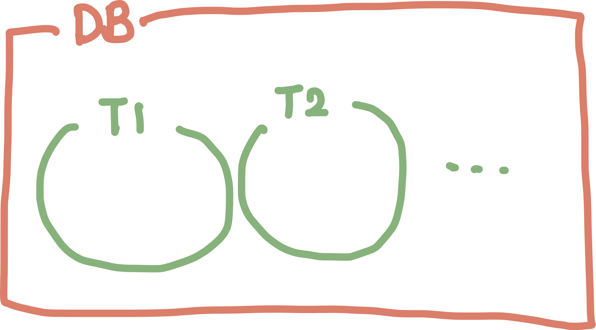
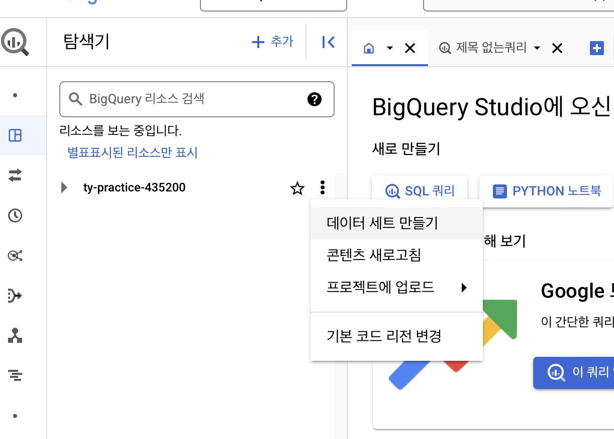
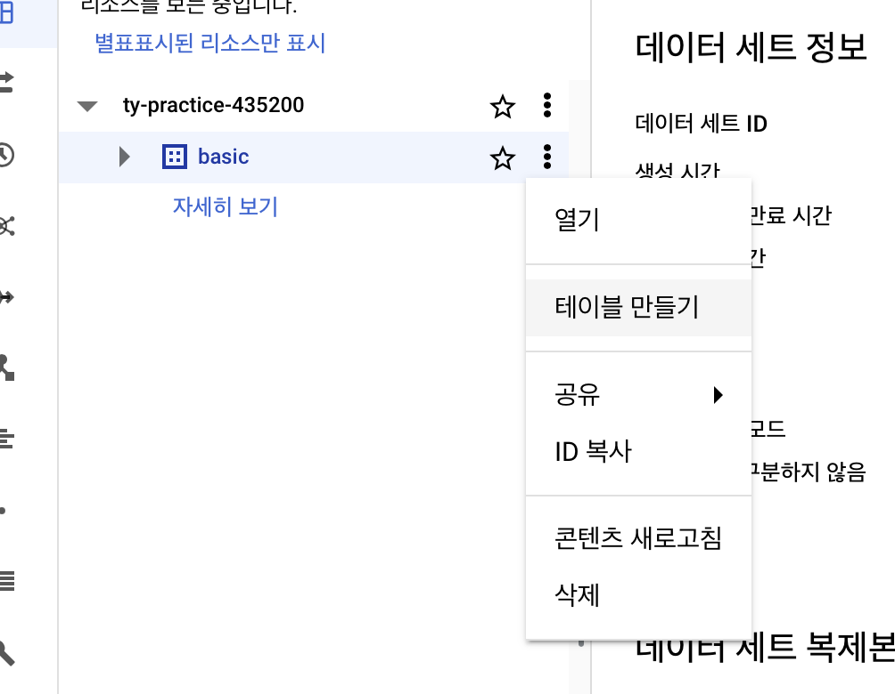
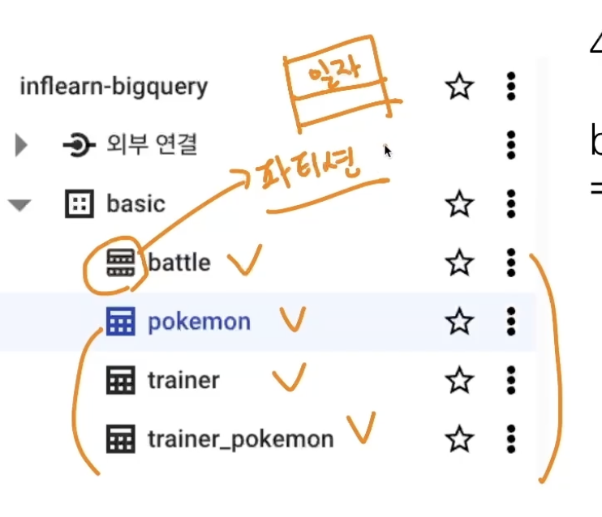
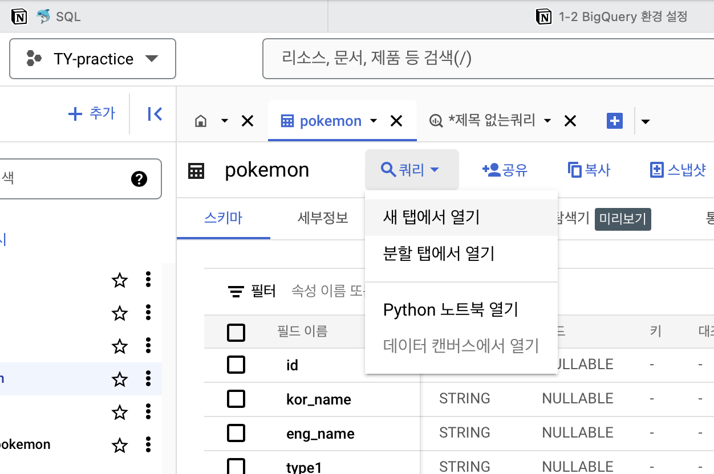
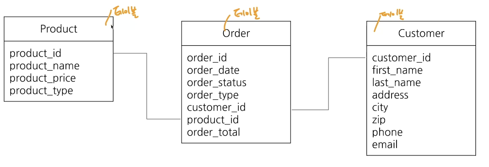
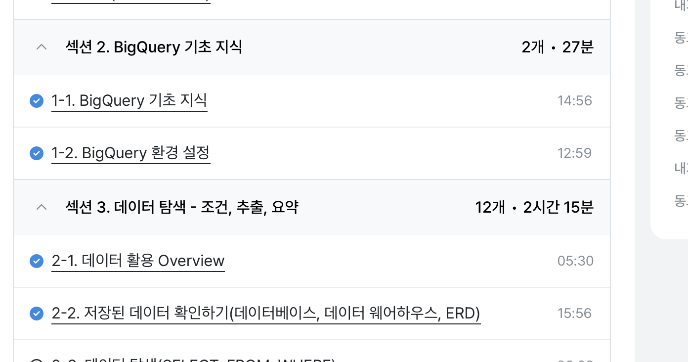

# 1-1 BigQuery 기초 지식

# 1. 데이터 저장 형태

데이터는 보통 데이터베이스 테이블 등에 저장한다

### DataBase(DB)

데이터의 저장소

### Table

데이터가 저장된 공간

# 2. 데이터가 저장되는 장소

MySQL, Oracle 등등 회사 by 회사

+ AWS Aurora : 클라우드 기반

# 3. OLTP ⇒ MySQL, Oracle, PostgreSQL

거래를 하기 위해 사용되는 데이터베이스

→ 보류, 중간 상태가 없다 : 데이터가 무결하다

INSERT, UPDATE가 많이 발생한다

SQL을 이용하여 데이터를 추출할 수 있으나, 분석을 위해 만든 데이터베이스가 아니라 쿼리 속도가 느리다.

# 4. SQL

데이터베이스에서 데이터를 가지고 올 때 사용하는 언어

💡 쿼리를 짠다

# 5. 테이블에 저장된 데이터의 형태

|  | Column 1 | Column 2 |
| --- | --- | --- |
| Row1 |  |  |
| Row2 |  |  |

### Row

행

### Column

열 - 영단어는 원형 기둥이라는 뜻

<aside>
💡

행 : 데이터들의 특성
열 : 한 Object

</aside>

# 6. OLAP와 데이터 웨어하우스(DW)의 등장

속도, 기능 부족의 이슈로 OLAP가 등장함

### OLAP

Online **Analytical** Processing

### 데이터 웨어하우스

데이터를 한 곳에 모아서 저장한다

ex) 데이터베이스, 웹, 파일, API 등

# 7. Big Query

Google Cloud의 웨어하우스

# 8. Big Query 장점

### OLAP

속도가 빠르지만, 그만큼 돈을 지불하게 된다

### 데이터 추출

Firebase, Google Analytics등 의 데이터를 쉽게 추출할 수 있음

### 서버

서버를 띄울 필요가 없다 → 구글에서 인프라를 관리함

# 9. BigQuery를 사용하는 이유

 운영을 적은 비용으로 진행하기 위해

 앱이나 웹에서 Firebase 혹은 Google Analytics4를 사용하는 경우

# 10. BigQuery 비용(미국 저장)

### 쿼리

탐색 비용

- On-demand 요금제
- Capacity 요금제

### 저장

저장 비용

- Active Logical
- Long-term Logical

# 1-2 BigQuery 환경 설정

# Google Cloud설정

## 1. Google Cloud 설정

1. Google Cloud Console로 이동
2. 프로젝트 선택
3. 새 프로젝트
4. 프로젝트 아이디 기억 : ty-practice-435200

## 2. 환경 구성 요소

### 프로젝트

하나의 큰 건물

하나의 프로젝트에 여러 데이터셋이 존재할 수 있음

### 데이터셋

프로젝트에 있는 창고 - 창고 마다 데이터를 저장

하나의 데이터셋에 다양한 테이블이 있음

### 테이블

창고에 있는 선반

세부 정보가 저장

# 3. 데이터셋 생성

테이블과 파티션 테이블 그림이 다르다

# 2-1 데이터 활용 Overview

# 1. 데이터를 활용하는 과정

1. task
2. 목적
3. 데이터 탐색 → 단일 자료 or (다량 자료 → 연결)
    1. 조건, 추출, 변환, 요약
4. **데이터 결과 검증** : 예상과 실제의 검증
5. 피드백 / 활용

# 2-2 저장된 데이터 확인하기

# 1. 데이터

데이터를 추출하기 전에 **데이터 웨어하우스에 데이터가 어떻게 저장되어 있는지 확인**해야 한다.

<aside>
💡

웨어하우스 → 테이블

</aside>

# 2. ERD

데이터베이스 수조를 한눈에 알아보깅 위해 사용

> ERD 예시
> 

# 3. ERD가 없다면 → 데이터 탐색

- 어떤 **테이블**이 존재하는가?
- 어떤 **컬럼**이 존재하는가?
- 다른 **테이블과 연결할 때 어떤 컬럼**을 사용하는가?
- 컬럼의 값들은 **어떤 의미**를 가지는가?

# 4. 회사의 데이터(예시)

## 서비스에 사용될 데이터베이스

- 유저
- 배송
- 물건 등

## 앱/웹 로그 데이터

과정을 알 수 있는 데이터

## 공공 데이터, 서드파티 데이터

---

> **수행 인증**
> 

