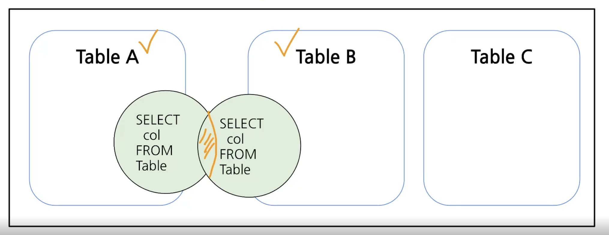
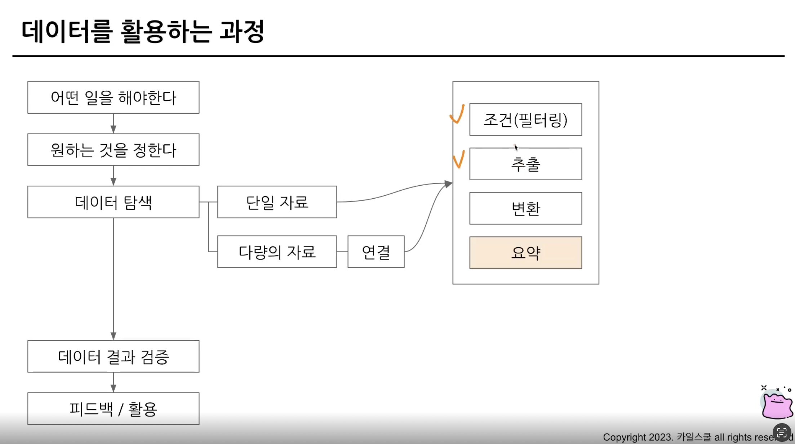
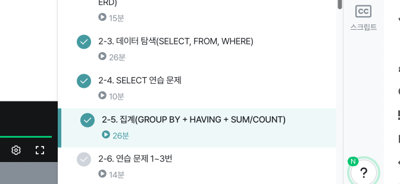

# 데이터 탐색 - 조건, 추출, 요약
## 데이터 탐색(SELECT, FROM, WHERE)
### SQL 쿼리 구조
SELECT, FROM, WHERE

#### FROM
| 어떤 테이블에서 데이터를 확인할 것인가?   

#### WHERE
| 언하는 조건이 있다면 어떤 조건인가?

#### SELECT
| 테이블의 어떤 컬럼을 선택할 것인가?

#### 예시

```SQL
SELECT
*
FROM basic.pokemon
WHERE
    type1 = "Fire"
````

\* : 모든 컬럼 선택 - 빅 쿼리는 1TB 6달러정도 사용되기때문에 비용상 문제가 된다. (현업에서는 사용하지 말 것)

##### SELECT *

```SQL
SELECT
*
```

데이터 확인을 위해 사용하긴 하나, big-query같은 경우에는 미리보기를 지원한다

##### SELECT * EXCEPT()

```SQL
SELECT
* EXCEPT("제외할 컬럼")
```

### 데이터가 여러 장소에 저장되어 있는 경우

<br>
Table에 있는 데이터를 연결하여...

### 실습
```SQL
SELECT 
id AS pokemon_id
FROM `ty-practice-######.basic.pokemon`
# <프로젝트id>(꼭 명시 필요 X - 하지만 여러 프로젝트를 진행하고 있으면 써주는게 좋음).<테이터셋>.<테이블>
WHERE
  type1 = "Fire";
# AS 별칭 처리
````

#### 데이터 웨어하우스
| <프로젝트 id(선택)>.<데이터셋>.<테이블>

### 쿼리의 실행순서
1. FROM : 데이터를 확인할 Table을 명시
2. WHERE : FROM에 명시된 Table에서 데이터를 필터링
3. SELECT : Table에 저장되어 있는 컬럼 선택, 여러 컬램 지정 가능
```SQL
SELECT
컬럼 들
FROM 테이블
WHERE 조건문
```
---
## SELECT 연습문제
### 1. trainer 테이블에 있는 모든 데이터를 보여주는 쿼리
```SQL
SELECT
*
FROM basic.trainer;
````
###  2. trainer 테이블에 있는 이름을 출력
```SQL
SELECT 
name
FROM `ty-practice-######.basic.trainer`
```
### 3. trainer 테이블에 있는 트레이너의 이름, 나이를 출력하는 쿼리
```SQL
SELECT
name, age
FROM `ty-practice-435200.basic.trainer`
````
### 4. trainer 테이블에 있는 이름, 나이, 고향에서 id = 3인 
```SQL
SELECT  
name,
age,
hometown
FROM `ty-practice-435200.basic.trainer`
WHERE id = 3;
````
### 5. pokemon 테이블 "피카츄"의 공격력과 체력을 확일할 수 있는 쿼리를 작성해주세요
```SQL
SELECT
attack,
hp
FROM `ty-practice-######.basic.pokemon`
WHERE
  kor_name = "피카츄";
```

## 집계(GROUP BY + HAVING + SUM/COUNT)

<br>
   
### 집계와 그룹화(GROUP BY)
같은 값끼리 모아서 그룹화한다.   
특정 컬럼을 기준으로 모으면서 다른 컬럼에선 집계 가능(합, 평균, MAX, MIN)  
#### 예시
```SQL
SELECT
  집계할_컬럼1
  집계 함수(COUNT, MAX, MIN 등)
FROM Table
GROUP By
  집계할_컬럼1
```

### DISTINCT : 교유값을 알고 싶은 경우
중복을 제거하는것 - Unique한 것만 보고 싶은 경우 사용
```SQL
SELECT
집계할 컬럼,
COUNT(DISTINCT count할-컬럼)
FROM table
GROUP BY
집계할 컬럼
```
### GROUP BY 연습 문제 1
pokemon 테이블에 있는 포켓몬 수를 구하는 쿼리를 작성해주세요
```SQL
SELECT 
COUNT(DISTINCT kor_name)
FROM `ty-practice-435200.basic.pokemon`
````
### GROUP BY 연습 문제 2
포켓몬의 수가 세대별로 얼마나 있는지 알 수 있는 쿼리를 작성해주세요
```SQL
SELECT 
generation,
COUNT(kor_name)
FROM `ty-practice-435200.basic.pokemon`
GROUP BY generation
```
### 그룹화 활용 포인트
* 일자별 집계
* 연령대별 집계
* 특정 타입별 집계
* 앱 화면별 집계

### 조건을 설정하고 싶은 경우 : WHERE
| 테이블에 바로 조건을 사용하고 싶은 경우 사용

### 조건을 설정하고 싶은 경우 : HAVING
| GROUP BY한 후 조건을 설정하고 싶은 경우 사용   
주로 GROUP BY와 함께 사용

### 서브 쿼리
SELECT문 안에 존재하는 SELECT쿼리, FROM절에 또 다른 SELECT 문을 넣을 수 있음   
괄호로 묶어서 사용.  
서브 쿼리를 작성하고, 서브 쿼리 바깥에서 WHERE조건을 설정하는 것   
\= 서브 쿼리에서 HAVING으로 하는 것

### 정렬하기 : ORDER BY
| DESC(내림차순), QSC(오름차순 - default)   
중간에 필요 없음
| 쿼리문의 결과 Row 수를 제한하고 싶은 경우 사용   

### GROUP BY 연습 문제
포켓몬의 수를 타입 별로 집계하고, 포켓몬의 수가 10 이상인 타입만 남기는 쿼리를 작성해주세요. 포켓몬의 수가 많은 순으로 정렬해주세요
```SQL
SELECT 
type1,
COUNT(id)
FROM `ty-practice-435200.basic.pokemon`
GROUP BY
type1
HAVING
COUNT(id) > 10
ORDER BY COUNT(id) DESC;∏
````

# 인증
