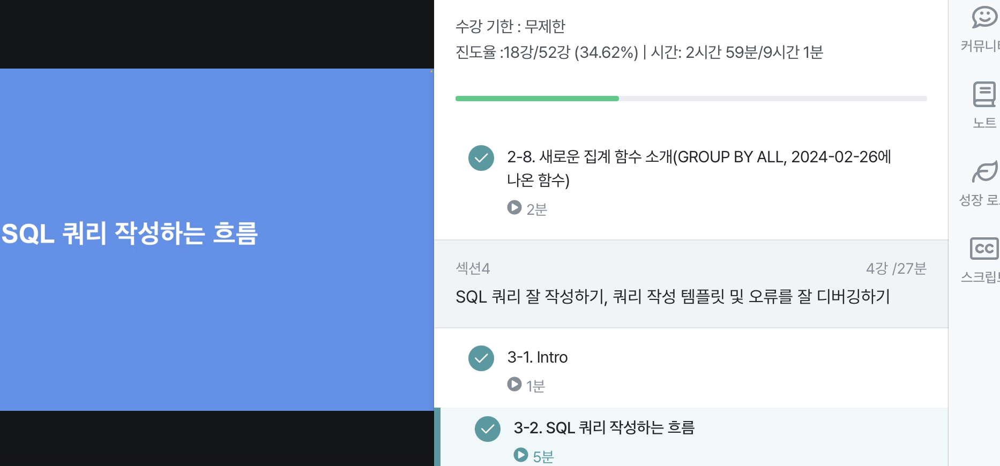

# 2-6 연습문제 1~3
1. 포켓몬 중에 type2가 없는 포켓몬의 수를 작성하는 쿼리를 작성해주세요
---
```SQL
SELECT COUNT(id) 
FROM `ty-practice-435200.basic.pokemon` AS pokemon
WHERE pokemon.type2 IS NULL;
````
---
2. type2가 없는 포켓몬의 type1과 type1의 포켓몬 수를 알려주는 쿼리를 작성해주세요. 단, type1의 포켓몬 수가 큰 순으로 정렬해주세요
---
```SQL
SELECT COUNT(id), type1
FROM `ty-practice-435200.basic.pokemon` AS pokemon
WHERE pokemon.type2 IS NULL
GROUP BY pokemon.type1
ORDER BY COUNT(id) DESC;
```
___
3. type2 상관없이 type1의 포켓몬 수를 알 수 있는 쿼리를 작성해주세요
___
```SQL
SELECT type1, COUNT(id) AS CNT
FROM `ty-practice-435200.basic.pokemon`
GROUP BY type1
```
---
# 2-6 연습문제 4~6
---
4. 전설 여부에 따른 포켓몬 수를 알 수 있는 쿼리를 작성해주세요.
---
```SQL
SELECT COUNT(id), is_legendary
FROM `ty-practice-435200.basic.pokemon`
GROUP BY is_legendary
```
---
5. 동명 이인이 있는 이름은 무엇일까요?
---
```SQL
SELECT name, COUNT(name)
FROM `ty-practice-435200.basic.trainer`
GROUP BY name
HAVING COUNT(name) >= 2;
````
---
6. trainer테이블에서  "Iris"트레이너의 정보를 알 수 있는 쿼리를 작성해주세요
---
```SQL
SELECT *
FROM `ty-practice-435200.basic.trainer`
WHERE name = "Iris"
```
---
7. trainer 테이블에서 "Iris", "Whitney", "Cynthia" 트레이너의 정보를 알 수 있는 쿼리를 작성해주세요
---
```SQL
SELECT *
FROM `ty-practice-435200.basic.trainer`
WHERE name IN ("Iris", "Whitney", "Cynthia")
```
---
8. 전체 포켓몬 수는 얼마나 되나요?
---
```SQL
SELECT 
COUNT(id) 
FROM `ty-practice-435200.basic.pokemon`
```
9. 세대별로 포켓몬 수가 얼마나 되는지 알 수 있는 쿼리를 작성해주세요
---
```SQL
SELECT generation, COUNT(id)
FROM `ty-practice-435200.basic.pokemon`
GROUP BY generation
```
---
10. type2가 존재하는 포켓몬의 수는 얼마나 되나요?
---
```SQL
SELECT COUNT(id)
FROM `ty-practice-435200.basic.pokemon`
WHERE type2 IS NOT NULL;
```
---
11. type2가 있는 포켓몬 중에 제일 많은 많은 type1은 무엇인가요?
---
```SQL
SELECT type1, COUNT(id)
FROM `ty-practice-435200.basic.pokemon`
WHERE type2 IS NOT NULL
GROUP BY type1
ORDER BY COUNT(id) DESC
LIMIT 1;
```
---
12. 단일 타입 포켓몬 중 많은 type1은 무엇일까요?
---
```SQL
SELECT type1, COUNT(id)
FROM `ty-practice-435200.basic.pokemon`
WHERE type2 IS NULL
GROUP BY type1
ORDER BY COUNT(id) DESC
LIMIT 1;
```
---
13. 포켓몬의 이름에 "파"가 들어가는 포켓몬은 어떤 포켓몬이 있을까요?
---
```SQL
SELECT kor_name
FROM `ty-practice-435200.basic.pokemon`
WHERE kor_name LIKE "파%";
```
---
14. 뱃지가 6개 이상인 트레이너는 몇 명이 있나요?
---
```SQL
SELECT COUNT(id)
FROM `ty-practice-435200.basic.trainer`
WHERE badge_count >= 6;
```
---
15. 트레이너가 보유한 포켓몬이 제일 많은 트레이너는 누구일까요?
---
```SQL
SELECT trainer_id, COUNT(pokemon_id)
FROM `ty-practice-435200.basic.trainer_pokemon`
GROUP BY trainer_id
ORDER BY COUNT(pokemon_id) DESC;
```
---
16. 포켓몬을 많이 풀어준 트레이너는 누구일까?
---
```SQL
SELECT trainer_id, COUNT(pokemon_id)
FROM `ty-practice-435200.basic.trainer_pokemon`
WHERE status = "Released"
GROUP BY trainer_id
ORDER BY COUNT(pokemon_id) DESC
LIMIT 1;
```
---
17. 트레이너 별로 풀어준 포켓몬의 비율이 20%가 넘는 포켓몬 트레이너는 누구일까요?
---
```SQL
SELECT COUNTIF(status = "Released"), trainer_id, COUNT(pokemon_id), COUNTIF(status = "Released")/COUNT(pokemon_id)
FROM `ty-practice-435200.basic.trainer_pokemon`
GROUP BY trainer_id
HAVING COUNTIF(status = "Released")/COUNT(pokemon_id) > 0.2
```
---
## GROUP BY ALL
컬럼 명시 안해도됨

# SQL쿼리 작성 흐름
1. 지표고민 - 어떤 문제를 해결하기 위해 데이터가 필요한가?
2. 지표 구체화 - 추상적이지 않고 구체적인 지표 명시
3. 지표 탐색 - 유사한 문제를 해결한 케이스가 있나 확인
4. 쿼리 작성 - 데이터가 있는 테이블 찾기   
4.1. 1개 : 바로 활용   
4.2. 2개 이상 : JOIN
5. 데이터 정합성 확인 - 예상한 결과와 동일한지 확인
6. 가독성
7. 쿼리 저장 - 쿼리는 재사용되므로 문서로 저장

# 쿼리 작성 템플릿과 생상선 도구
```
# 쿼리를 작성하는 목표, 확인할 지표
# 쿼리 계산 방법 :
# 데이터의 기간 :
# 사용할 테이블 :
# Join KEY :
# 데이터 특징 :

SELECT

FROM
WHERE
```
## 생산성 도구
ESPANO -> 따로 템플릿 수정해봐야겠음

# 인증
