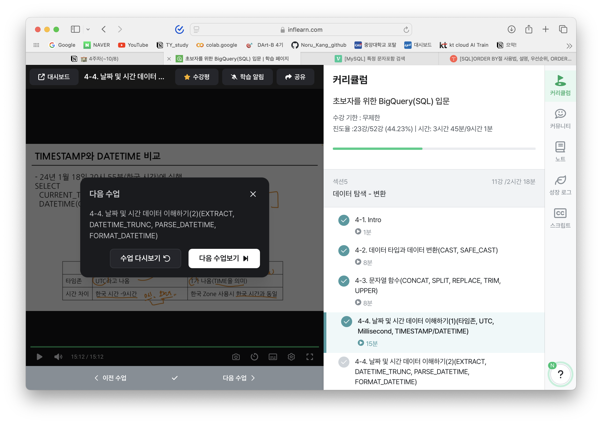

# 3-4 오류를 디버깅하는 방법

## 오류(error)
부정확하거나 잘못된 행동을 의미(정의)   
   
**오류 메세지가 알려주고자 하는 것**   
| 길잡이 + 문제 진단

## 대표적인 오류
### Syntax Error
문법 오류 - 문법을 지키지 않아 생기는 오류   

### Tip1
```SQL
LIMIT ...
```
은 항상 마지막에 사용되어야 한다

## 오류 해결의 핵심
오류 발생 - 오류 메시자와 함께 오류 발생 - 번역 해석   
오류 메시지 검색 - 구글, 공식문석, ChatGPT등을 활용해서 진행

---
---
# 4-2 데이터 타입과 데이터 변환
SELECT에서 데이터를 변환할 수 있다 또한 WHERE의 조건문에도 사용할 수 있다.

   
## 데이터 타입
* 숫자 : 정수, 실수
* 문자 : 문자, 문자열
* 시간, 날짜
* 부울 : T / F
  * WHERE문은 T만 가져오는 것
   
보이는것과 저장된 것의 차이가 존재한다 : 1 vs '1'

## 자료 타입 변경하기
```SQL
SELECT CAST(col AS dtype)
...;

SELECT SAFE_CAST(col AS dtype) # 안전 캐스팅
...;

```
**SAFE_ : 해당 단어가 붙은 함수는 변환이 실패할 경우 NULL값 반환**

## 수학 함수
암기를 굳이 하지 않아도 되지만, 사용할거 위주로 외우고 필요할때 찾으면 된다.
   
eg ) SAFE_DIVIDE : 하나라도 0인경우 zero 리턴

# 4-3 문자열 함수
## CONCAT
문자열 붙이기
```SQL
SELECT CONCAT("string", "string", ..., 'char')
...;
```
## SPLIT
문자열 분리하기
```SQL
SELECT SPLIT("A, B, C, D", "split할꺼")
...;
```
문자열 사이의 모든것을 카운트하기에 띄움이 있으면 띄워쓰기도 같이 적어줘야 한다
## REPLACE
```SQL
SELECT REPLACE("string", "st", "ab")
...;
```
## TRIM
문자열 자르기
```SQL
SELECT TRIM("string", "자를 단어")
```
## UPPER
소문자 -> 대문자
```SQL
SELECT UPPER("소문자")
```

# 4-4 날짜 및 시간 데이터 이해하기
## 시간데이터
DATE : 날짜   
DATETIME : 날짜 + 시간   
TIME : 시간   
TIMESTAMP : UTC부터 경과한 시간
## TIMEZONE
UTC : 협정 세계시 - 국제적인 표준 시간(한국 UTC + 9)
# 인증
