### CURRENT_DATETIME
### EXTRACT
| 특정 부분만 추출
```SQL
SELECT
    EXTRACT(DATE FROM DATETIME "2024-01-02 14:00:00") AS date;
```
date, year, month, day, hour, minute 등

| 요일 : 일요일부터 반환(일주일)
```SQL
SELECT EXTRACT(DAYOFWEEK FROM datetime_col);
```

### DATETIME_TRUNC
| date, hour만 남기는 경우 -> 시간 자르기
```SQL
SELECT
    DATETIME "2024-01-02 14:00:00" AS original_data
    DATETIME_TRUNC(DATETIME "2024-01-02 14:00:00", DAY) AS day_trunc
```
day, year, month, hour 가능   
hour많이 사용함

### PARSE_DATETIME (문자열 -> DATETIME)
| 문자열 -> DATETIME타입
```SQL
PARSE_DATETIME('문자열 형태', 'DATETIME 문자열') AS datetime

PARSE_DATETIME('%Y-%m-%d %H:%M:%S', '2024-01-11 12:30:45') AS datetime
```
파싱 : 변환이라고 생각하면...

### FORMAT_DATETIME (DATETIME -> 문자열)
| DATETIME -> 문자열
```SQL
SELECT FORMAT_DATETIME("%c", DATETIME "2024-01-11  12:35:35") AS formatted ;
```
### LAST_DAY
| 마지막날
```SQL
SELECT LAST_DAY(DATETIME '2024-01-03 14:34:00') AS last_day, LAST_DAY(DATETIME '2024-01-03 14:34:00', MONTH) AS last_day_month;
```
default : month 보통 달기준으로 많이 사용   
month, week, week(요일)

### DATETIME_DIFF
| DATETIME의 차이
```SQL
SELECT DATETIME_DIFF(first_datetime, second_datetime, WEEK) AS day_diff
FROM 
(
    SELECT
        DATETIME "2024-04-02 10:20:00" AS first_datetime,
        DATETIME "2021-01-01 15:00:00" AS second_datetime
);
```
### 1~5
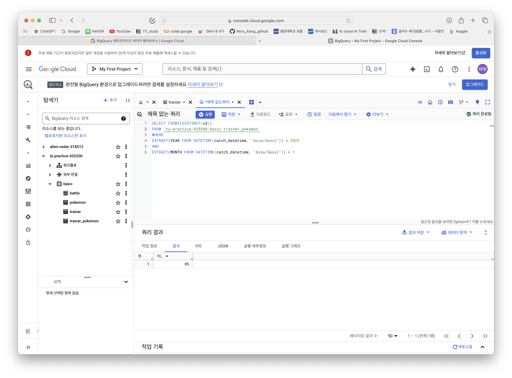
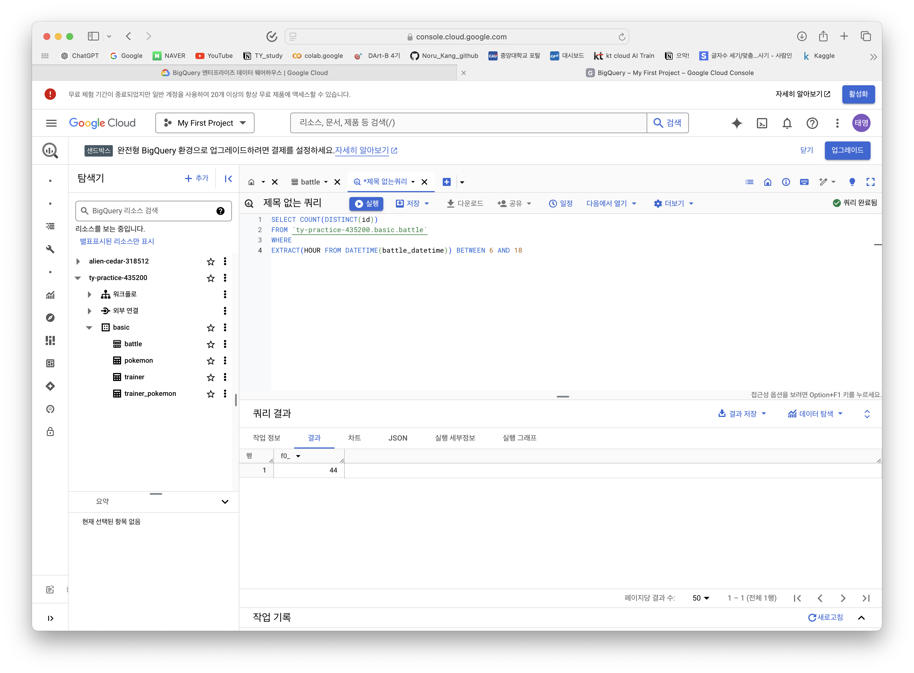
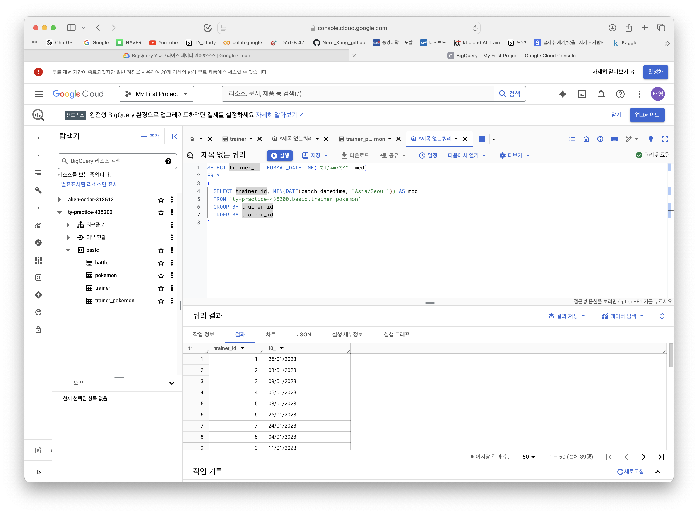
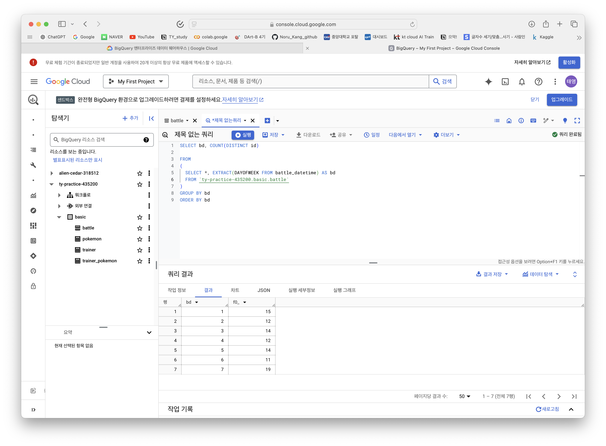
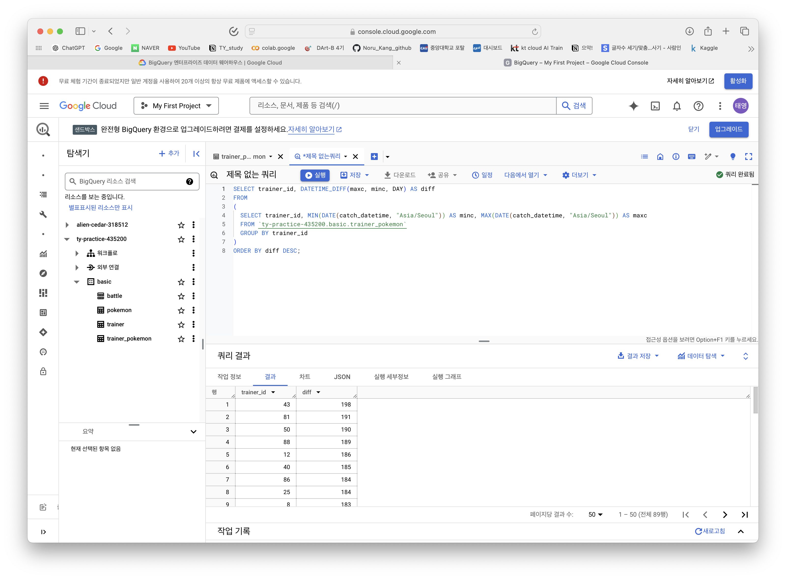

### 조건문 함수
| 특정 조건이 충족되면 어떤 행동을 하자!
특정 카테고리를 하나로 합치는 전처리가 필요할 수 있음!   

### CASE WHEN
| 여러 조건이 있을때 유용
```SQL
SELECT
CASE 
WHEN 조건 1 THEN 결과
...
ELSE 결과
EDN AS 새로운 컬럼 이름
```
순서가 매우 중요!

### IF
| 단일 조건
```SQL
SELECT
IF (1=1, "동일결과", "동일X") AS result1
IF (1=2, ...
```
### 1~6
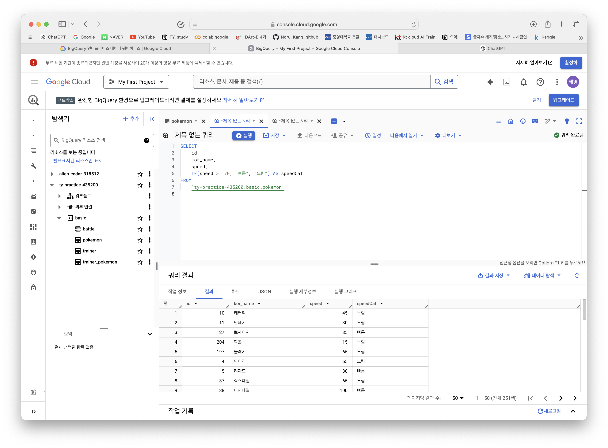
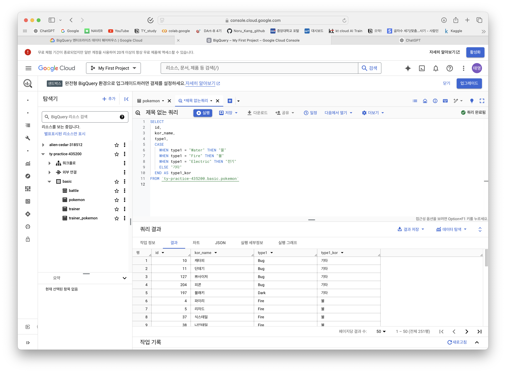
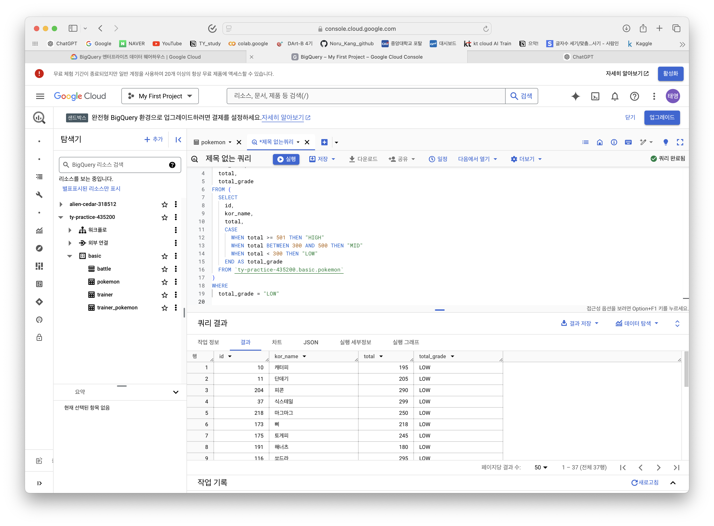
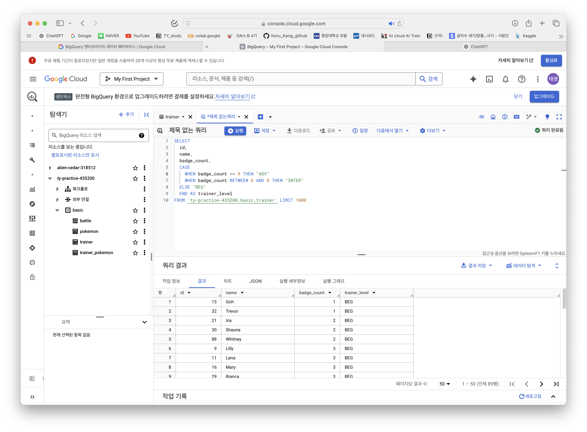
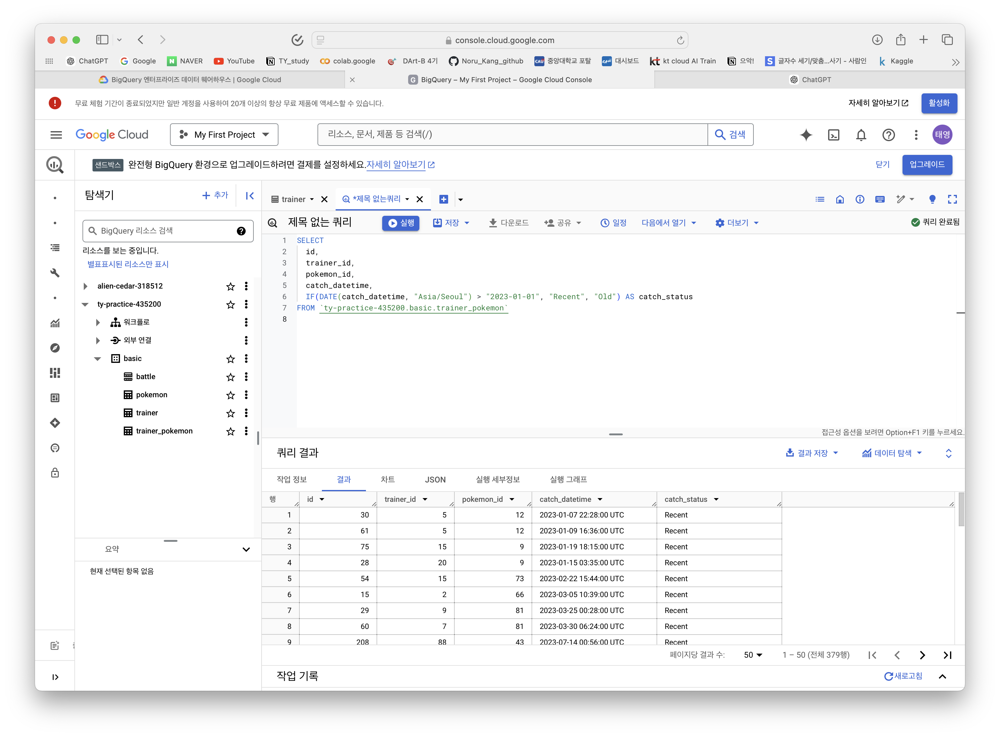
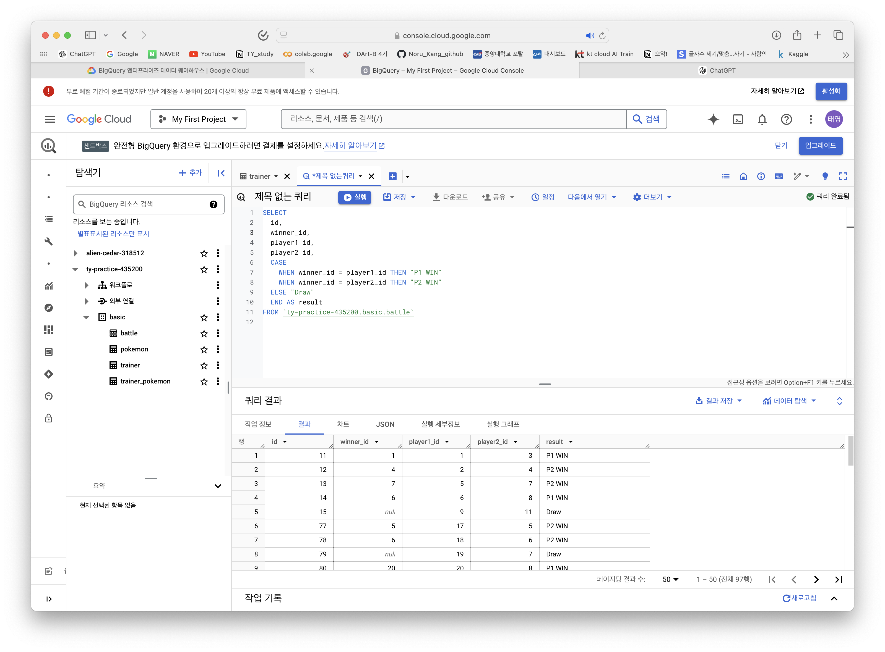

### 인증
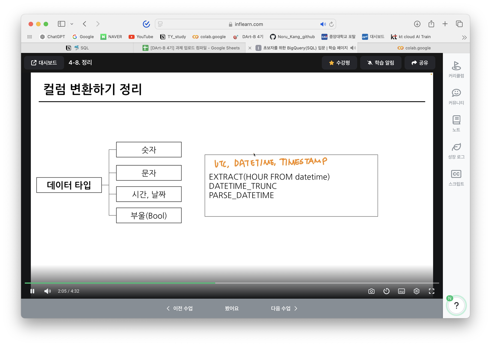