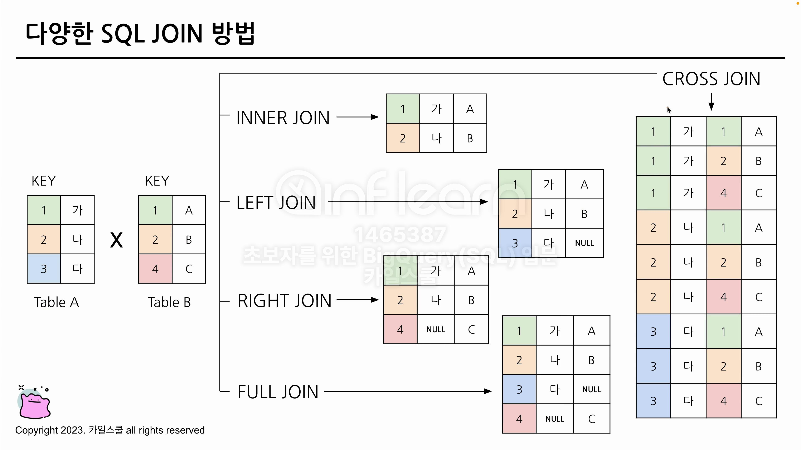
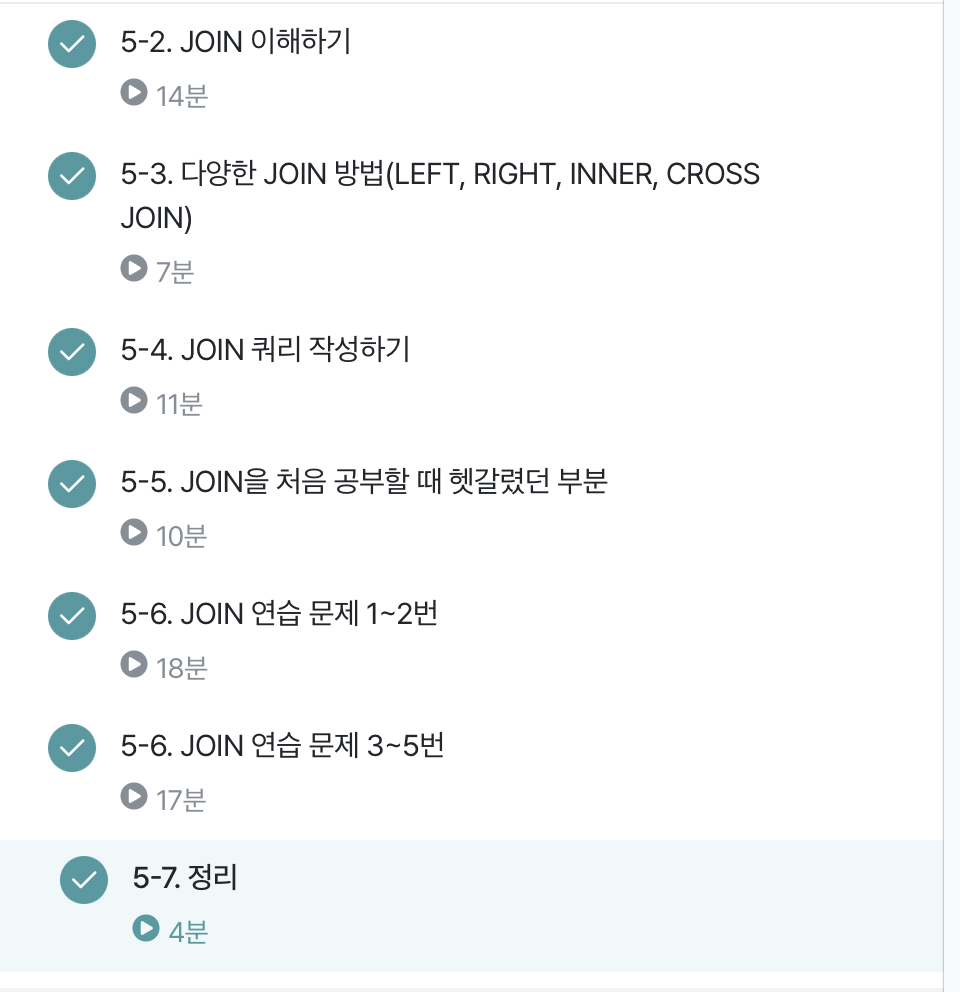

# 5-1. Intro
# 5-2. JOIN 이해하기
> 서로 다른 데이터 테이블을 연결하는 것 - 두 데이터의 연결 값으로 연결   

📌 판다스의 concat

### 왜 사용할까?
 정규화 과정을 거치게 되고(중복을 최소화하게 데이터 구조화)이 과정에서 분리되어있는 것이 좋음
# 5-3. 다양한 JOIN 방법
```SQL
(INNER) JOIN : 두 테이블 공통요소 - 교집합
LEFT/RIGHT (OUTER) JOIN : 기준으로 연결 - A만
FULL (OUTER) JOIN : 양쪽으로 연결 - 합집합
CROSS JOIN : 각각의 요소 곱하기
```

# 5-4. JOIN 쿼리 작성하기
1. 테이블 확인
2. 기준 테이블 정의 : 가장 많이 참고할 기준 테이블 정의
3. JOIN Key 찾기 - 연결할 Key
4. 결과 예상하기
5. 쿼리 작성 및 검증
```SQL
SELECT
  A.col1,
  A.col2,
  B.col1,
  ...
FROM table1 AS A
LEFT JOIN table2 AS B
ON A.key = B.key
```
### FROM 밑에 JOIN
### JOIN 후 JOIN도 가능하다
```SQL
SELECT 
    tp.id,
    tp.trainer_id,
    tp.pokemon_id,
    t.id AS trainer_id,
    t.age,
    t.hometown,
    p.*
FROM `ty-practice-435200.basic.trainer_pokemon` AS tp
LEFT JOIN `ty-practice-435200.basic.trainer` AS t
ON tp.trainer_id = t.id
LEFT JOIN `ty-practice-435200.basic.pokemon` AS p
ON tp.pokemon_id = p.id;
```
`EXCEPT(col)`을 활용하면 제외가능
# 5-5. JOIN을 처음 공부할 때 헷갈렸던 부분
* 기준이 되는 Table을 왼쪽에 두기
* JOIN의 개수는 한계가 없음
* 사용하지 않을 컬럼을 선택하지 않는게 비용을 줄일 수 있다
* NULL 값이 없음

# 문제
## 1
FLOPs관점에서 JOIN하기전 줄이면 좋음
```SQL
SELECT
  tp.*,
  p.kor_name
FROM(
SELECT 
  id,
  trainer_id,
  pokemon_id,
  status
FROM basic.trainer_pokemon
WHERE status IN ('Active', 'Training')
) AS tp
LEFT JOIN basic.pokemon AS p
ON tp.trainer_id = p.id
```

## 2
```SQL
SELECT
  tp.*,
  p.type1
FROM (
  SELECT
    id,
    trainer_id,
    pokemon_id,
    status
  FROM basic.trainer_pokemon
  WHERE
  status IN ("Active", "Training")
) AS tp
LEFT JOIN basic.pokemon AS p
On tp.pokemon_id = p.id
WHERE p.type1 = "Grass"
```

## 3
```SQL
SELECT
  COUNT(DISTINCT tp.trainer_id) AS trainer_uniq,

FROM basic.trainer AS t
LEFT JOIN basic.trainer_pokemon AS tp
On t.id = tp.trainer_id
WHERE
  tp.location IS NOT NULL
  AND t.hometown = tp.location
```

## 4
```SQL
SELECT
  type1,
  COUNT(tp.id) AS pokemon_cnt

FROM (
  SELECT
  id,
  trainer_id,
  pokemon_id,
  status,
  FROM basic.trainer_pokemon
  WHERE
  status IN ("Active", "Training")
) AS tp
LEFT JOIN basic.pokemon AS p
ON tp.pokemon_id = p.id
LEFT JOIN basic.trainer AS t
ON tp.trainer_id = t.id
WHERE
t.achievement_level = "Master"
GROUP BY
type1
ORDER BY
2 DESC
LIMIT 1
```

## 5
```SQL
SELECT
 generation,
 COUNT(tp.id) AS pokomon_cnt

FROM (
  SELECT
  id,
  trainer_id,
  pokemon_id,
  status
  FROM basic.trainer_pokemon
  WHERE
  status IN ("Active", "Training")
) AS tp
LEFT JOIN basic.trainer AS t
ON tp.trainer_id = t.id
LEFT JOIN basic.pokemon AS p
ON tp.pokemon_id = p.id
WHERE
t.hometown = "Incheon"
GROUP BY
generation
```
# 5-7.정리
여러 테이블 연결할 때 사용, 공통적으로 가지고 있는 컬럼을 가지고 KEY를 사용


