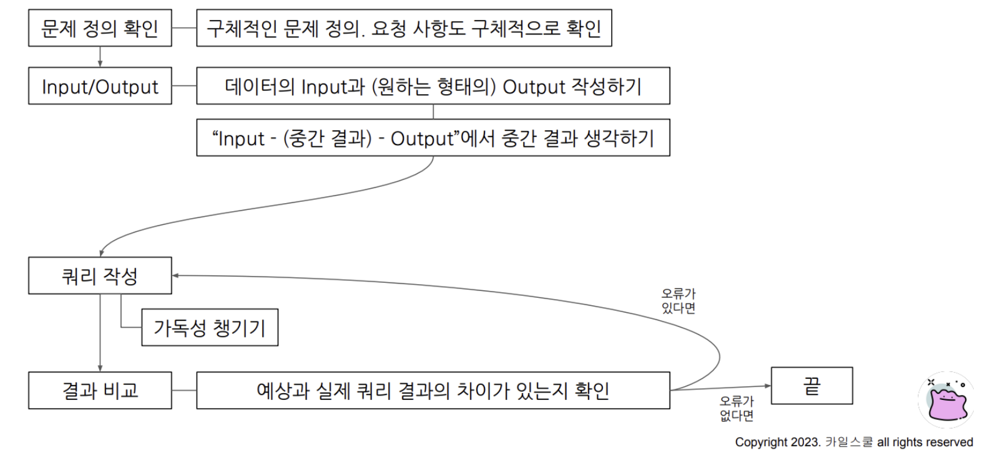
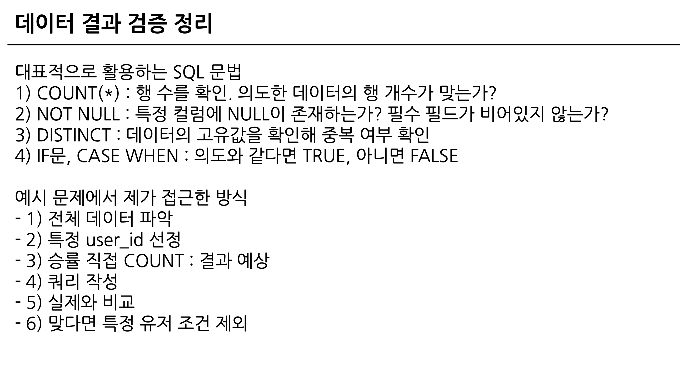

## 2. 가독성을 챙기기 위한 SQL가이드
* 데이터 검증 전 실수 발생 위치   
-> 문법, 데이터 파악X, 쿼리 복잡
* 이를 해결하기 위해 가이드 존재
1. 예약어
2. 컬럼명 : camelCase, snake_case
3. 별칭 : 명시적인것
4. 왼쪽 정렬
5. 예약어하 컬럼은 한 줄에 하나씩 권장
6. 쉼표의 위치 - 의견이 갈리는 부분
## 3. with문 & 파티션
```SQL
# 쿼리의 최상단에 사용 + 쿼리를 정의해 재사용 가능 
WITH temp_table AS(
    SELECT
        col1, col2
    FROM
        Table
    ), temp_table2 AS(
        SELECT
            col3
        FROM Table2
    )

SELECT
    col1, col2
FROM temp_table
```
```SQL
# 파티션 : 쿼리 성능 향상, 데이터 관리 용이, 비용절감
SELECT 
  id,
  player1_id,
  player2_id
FROM `dart-b-bigquery.basic.battle` 
WHERE battle_datetime BETWEEN DATETIME("2022-01-07") AND DATETIME_ADD("2024-11-07", INTERVAL 1 DAY) 
;

WITH sample AS (
  SELECT 
    id,
    player1_id,
    player2_id
  FROM `dart-b-bigquery.basic.battle` 
), sample2 AS (
  SELECT
    id,
    name,
    hometown
  FROM basic.trainer
  WHERE
    id = 3
)
SELECT
  *
FROM sample2
;
```
## 4. 데이터 결과 검증 정의

* SQL 쿼리 후 얻은 결과가 예상과 일치하는 지확인
* 신뢰성 확보, 정확성 확보
* 쿼리 작성
* 두개가 일치하는 지 비교
* 중요한 부분 : 문제 정의 미리 작성 + 도메인 특수성 파악

### 팁
* COUNT(*): 행 수를 확인.
* NOT NULL: 특정 컬럼에 NULL
* DISTINCT: 데이터의 고유값
* IF문, CASE WHEN: 의도와 같다면 TRUE, 아니면 FALSE

## 5. 예시
프로세스 흐름   
1. 데이터 파악   
2. 특정 id 선정
```SQL
SELECT
    *
FROM basic.battle
WHERE
    player1_id = 7;

SELECT
    *
FROM basic.battle
WHERE
    (player1_id = 7) OR (player2_id);
```
3. 승률 직접 카운트
4. 쿼리 작성 트레이너 승률 비율
```SQL
SELECT
  *
FROM (
  SELECT
    id AS battle_id,
    player1_id AS trainer_id,
    winner_id
  FROM basic.battle
  UNION ALL
  SELECT
    id AS battle_id,
    player2_id AS trainer_id,
    winner_id
  FROM basic.battle
)
ORDER BY battle_id;

WITH battle_basic AS (
  SELECT
    id AS battle_id,
    player1_id AS trainer_id,
    winner_id
  FROM basic.battle
  UNION ALL
  SELECT
    id AS battle_id,
    player2_id AS trainer_id,
    winner_id
  FROM basic.battle
)
SELECT
  trainer_id,
  COUNT(*) AS total_battles,
  COUNT(DISTINCT battle_id) AS unique_battles
FROM battle_basic
WHERE trainer_id = 7
GROUP BY
  trainer_id;

WITH battle_basic AS (
  SELECT
    id AS battle_id,
    player1_id AS trainer_id,
    winner_id
  FROM basic.battle
  UNION ALL
  SELECT
    id AS battle_id,
    player2_id AS trainer_id,
    winner_id
  FROM basic.battle
)
SELECT
  *,
  CASE
    WHEN trainer_id = winner_id THEN "WIN"
    WHEN winner_id IS NULL THEN "DRAW"
    ELSE "LOSE"
  END AS battle_result
FROM battle_basic
WHERE trainer_id = 7
;
```
마지막 코드에서 중복 확인됨
```SQL
WITH battle_basic AS (
  SELECT
    id AS battle_id,
    player1_id AS trainer_id,
    winner_id
  FROM basic.battle
  UNION ALL
  SELECT
    id AS battle_id,
    player2_id AS trainer_id,
    winner_id
  FROM basic.battle
)
SELECT
  *,
  CASE
    WHEN trainer_id = winner_id THEN "WIN"
    WHEN winner_id IS NULL THEN "DRAW"
    ELSE "LOSE"
  END AS battle_result
FROM battle_basic
WHERE trainer_id = 7
;
```
실제와 비교
```SQL
WITH battle_basic AS (
  SELECT
    id AS battle_id,
    player1_id AS trainer_id,
    winner_id
  FROM basic.battle
  UNION ALL
  SELECT
    id AS battle_id,
    player2_id AS trainer_id,
    winner_id
  FROM basic.battle
), battle_with_result AS (
  SELECT
  *,
  CASE
    WHEN trainer_id = winner_id THEN "WIN"
    WHEN winner_id IS NULL THEN "DRAW"
    ELSE "LOSE"
  END AS battle_result
FROM battle_basic
WHERE trainer_id = 7
)
SELECT
  trainer_id,
  COUNTIF(battle_result = "WIN") AS win_count,
  COUNT(battle_id) AS total_battle_count,
  COUNTIF(battle_result = "WIN")/COUNT(DISTINCT battle_id) AS win_ratio
FROM battle_with_result
GROUP BY
  trainer_id
;
```
유저조건 제외 
```SQL
WITH battle_basic AS (
  SELECT
    id AS battle_id,
    player1_id AS trainer_id,
    winner_id
  FROM basic.battle
  UNION ALL
  SELECT
    id AS battle_id,
    player2_id AS trainer_id,
    winner_id
  FROM basic.battle
), battle_with_result AS (
  SELECT
  *,
  CASE
    WHEN trainer_id = winner_id THEN "WIN"
    WHEN winner_id IS NULL THEN "DRAW"
    ELSE "LOSE"
  END AS battle_result
FROM battle_basic
--WHERE trainer_id = 7
)
SELECT
  trainer_id,
  COUNTIF(battle_result = "WIN") AS win_count,
  COUNT(battle_id) AS total_battle_count,
  COUNTIF(battle_result = "WIN")/COUNT(DISTINCT battle_id) AS win_ratio
FROM battle_with_result
GROUP BY
  trainer_id
HAVING
total_battle_count >= 9
;
```
## 정리
