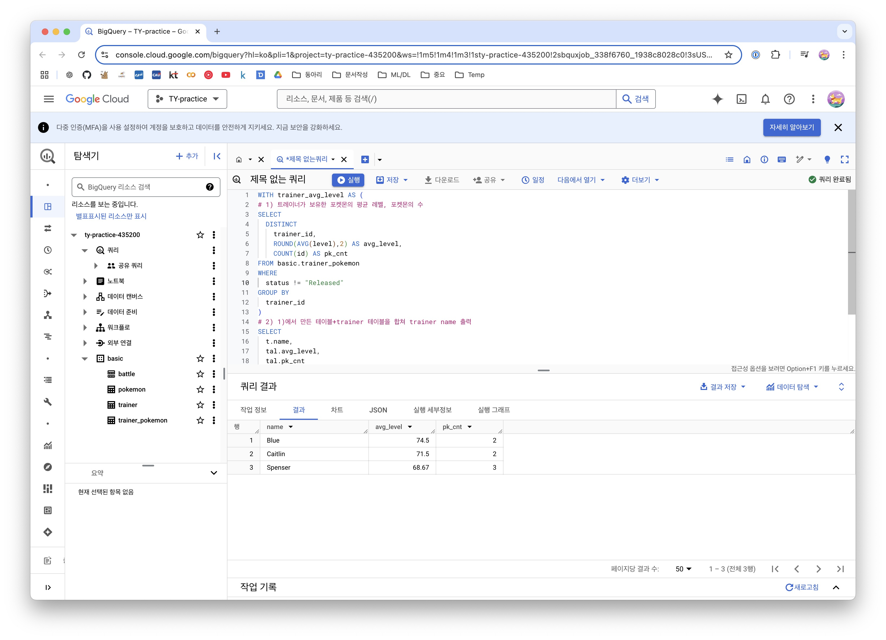
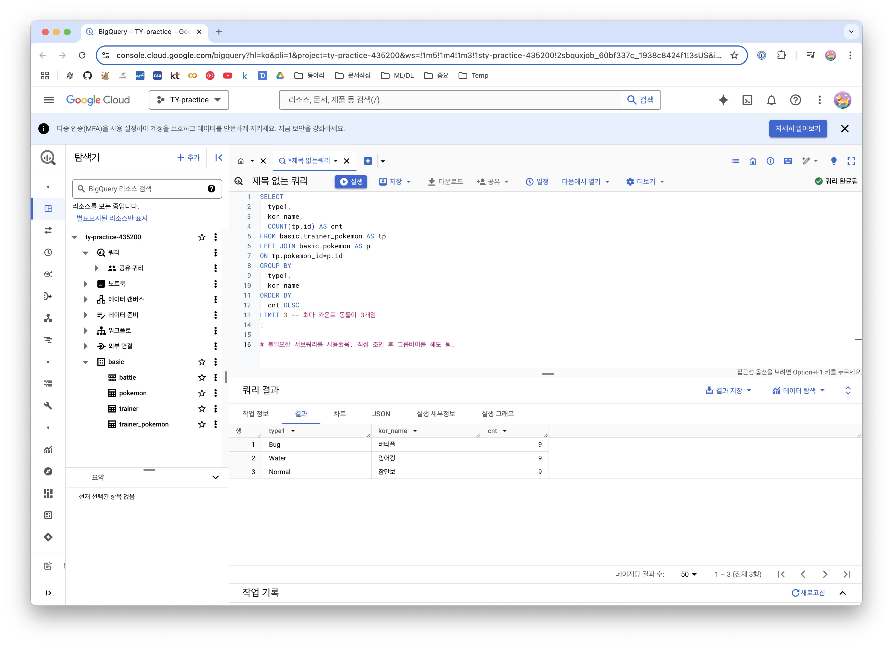
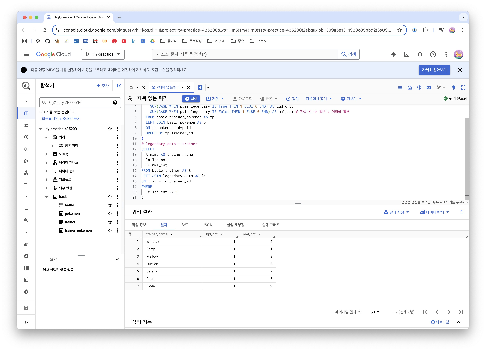
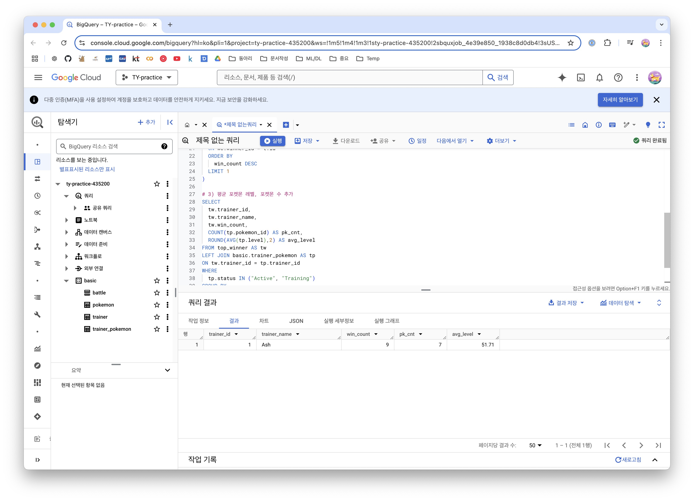
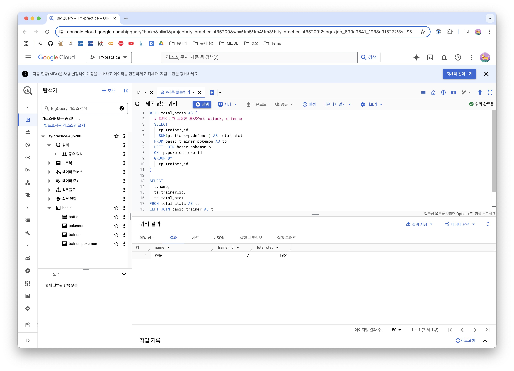
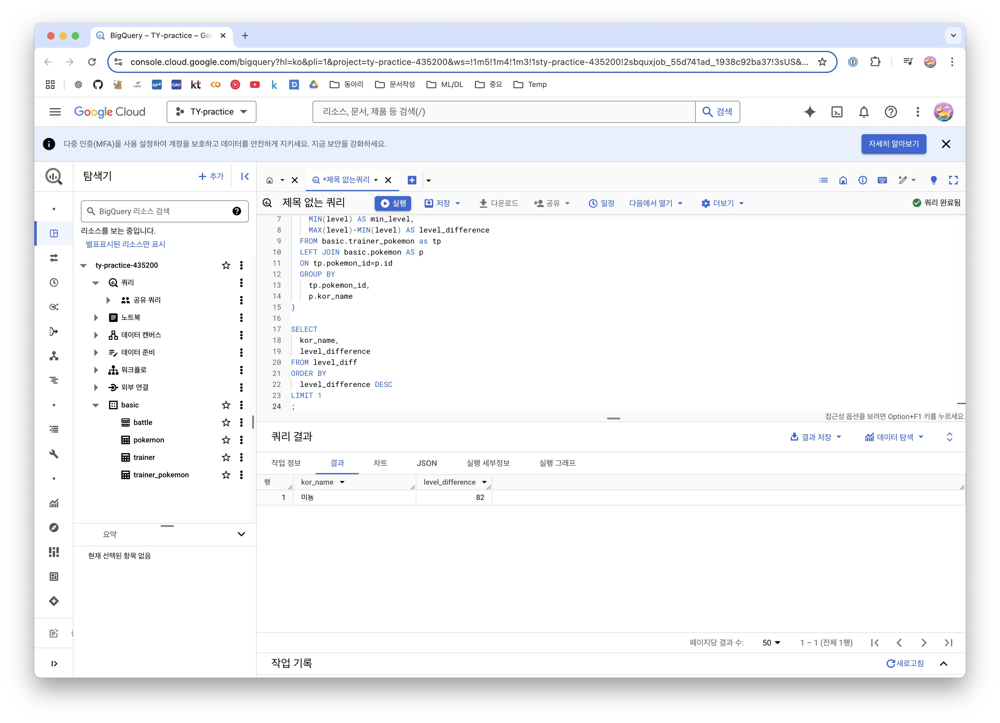
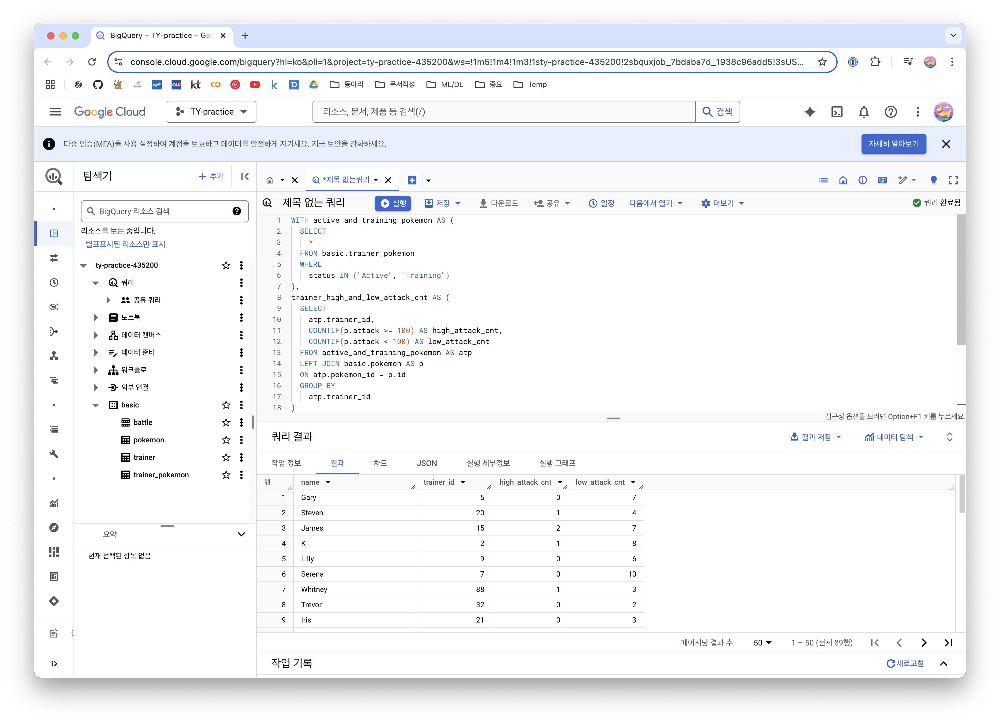
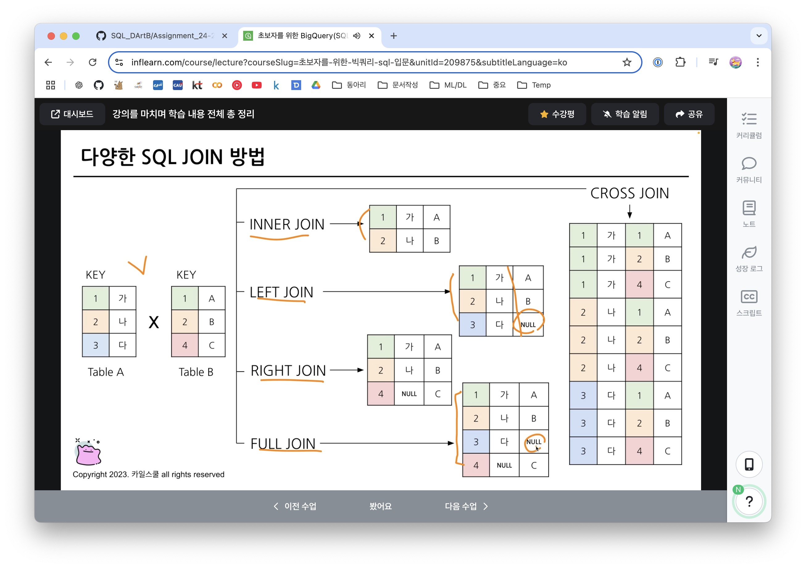
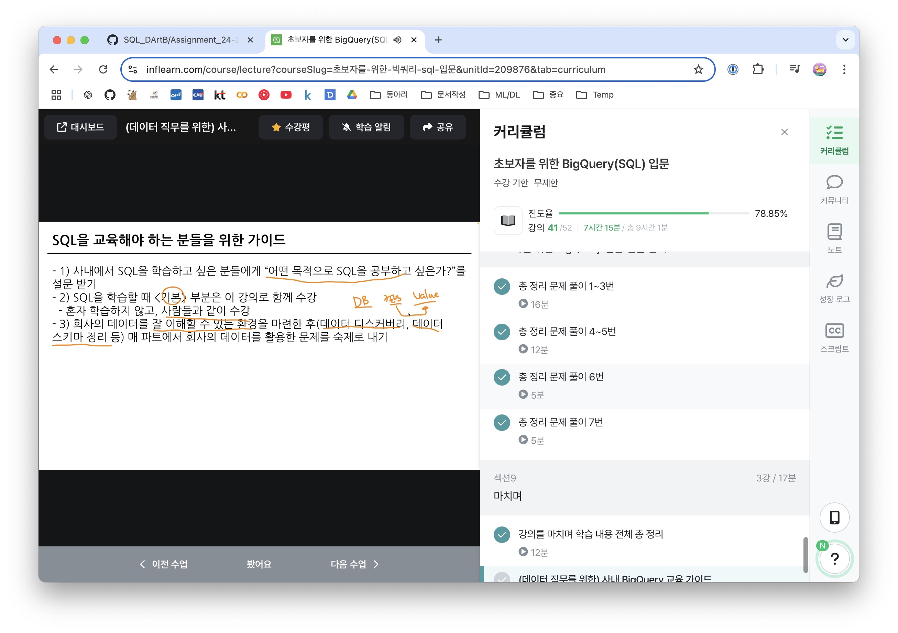

# 종합 문제 풀이
## 1
```SQL

WITH trainer_avg_level AS (
# 1) 트레이너가 보유한 포켓몬의 평균 레벨, 포켓몬의 수
SELECT
  DISTINCT
    trainer_id,
    ROUND(AVG(level),2) AS avg_level,
    COUNT(id) AS pk_cnt
FROM basic.trainer_pokemon
WHERE
  status != "Released"
GROUP BY
  trainer_id
)
# 2) 1)에서 만든 테이블+trainer 테이블을 합쳐 trainer name 출력
SELECT
  t.name,
  tal.avg_level,
  tal.pk_cnt
FROM basic.trainer AS t
LEFT JOIN trainer_avg_level AS tal
ON t.id=tal.trainer_id
ORDER BY
  avg_level DESC
LIMIT 3
;

```
| DISTINCT, GROUP BY로 중복구분 가능



## 2
```SQL

SELECT
  type1,
  kor_name,
  COUNT(tp.id) AS cnt
FROM basic.trainer_pokemon AS tp
LEFT JOIN basic.pokemon AS p
ON tp.pokemon_id=p.id
GROUP BY
  type1,
  kor_name
ORDER BY
  cnt DESC
LIMIT 3
;

# 불필요한 서브쿼리를 사용했음. 직접 조인 후 그룹바이를 해도 됨.

```



## 3
```SQL

WITH legendary_cnts AS (
  SELECT
    tp.trainer_id,
    SUM(CASE WHEN p.is_legendary IS True THEN 1 ELSE 0 END) AS lgd_cnt,
    SUM(CASE WHEN p.is_legendary IS False THEN 1 ELSE 0 END) AS nml_cnt # 전설 X -> 일반 : 여집합 활용
  FROM basic.trainer_pokemon AS tp
  LEFT JOIN basic.pokemon AS p
  ON tp.pokemon_id=p.id
  GROUP BY tp.trainer_id
)
# legendary_cnts + trainer
SELECT
  t.name AS trainer_name,
  lc.lgd_cnt,
  lc.nml_cnt
FROM basic.trainer AS t
LEFT JOIN legendary_cnts AS lc
ON t.id = lc.trainer_id
WHERE
  lc.lgd_cnt >= 1
;

```



* with 생각보다 유용
* COUNT, COUNTIF, SUM(CASE WHEN ~) : 숫자를 샐때 유용
* 가독성을 위해 한줄로 쓰기도
* 명확 -> IS TRUE, IS FALSE활용하면 명확하게 보여줄 수 있음
* COUNT == SUM(CASE WHEN ~ )

## 4
```SQL

WITH winner_counts AS (
  # 1) winner_id, COUNT(승리 횟수)
  SELECT
    winner_id,
    COUNT(winner_id) AS win_count
  FROM basic.battle
  WHERE
    winner_id IS NOT NULL
  GROUP BY
    winner_id
), 

top_winner AS (
  # 2) 이름
  SELECT
    wc.winner_id AS trainer_id,
    wc.win_count,
    t.name AS trainer_name
  FROM winner_counts AS wc
  LEFT JOIN basic.trainer AS t
  ON wc.winner_id = t.id
  ORDER BY
    win_count DESC
  LIMIT 1
)

# 3) 평균 포켓몬 레벨, 포켓몬 수
SELECT
  tw.trainer_id,
  tw.trainer_name,
  tw.win_count,
  COUNT(tp.pokemon_id) AS pk_cnt,
  ROUND(AVG(tp.level),2) AS avg_level
FROM top_winner AS tw
LEFT JOIN basic.trainer_pokemon AS tp
ON tw.trainer_id = tp.trainer_id
WHERE
  tp.status IN ("Active", "Training")
GROUP BY
  tw.trainer_id,
  tw.trainer_name,
  tw.win_count
```



* ORDER BY LIMIT 1
* 필터링에서 가장 승리가 많은 친구 뽑는게 데이터가 많을 때 좋음
* JOIN 3번, with문 잘 활용하는게 좋음
* WHERE ~ ("Active" ~ ) : 이런구문 많이 사용

## 5
```SQL

WITH total_stats AS (
  SELECT
    tp.trainer_id,
    SUM(p.attack+p.defense) AS total_stat
  FROM basic.trainer_pokemon AS tp
  LEFT JOIN basic.pokemon p
  ON tp.pokemon_id=p.id
  GROUP BY
    tp.trainer_id
)

SELECT
  t.name,
  ts.trainer_id,
  ts.total_stat
FROM total_stats AS ts
LEFT JOIN basic.trainer AS t
ON ts.trainer_id = t.id
ORDER BY total_stat DESC
LIMIT 1
;

```



## 6
```SQL

WITH level_diff AS (
  SELECT
    tp.pokemon_id,
    p.kor_name,
    MAX(level) AS max_level,
    MIN(level) AS min_level,
    MAX(level)-MIN(level) AS level_difference
  FROM basic.trainer_pokemon as tp
  LEFT JOIN basic.pokemon AS p
  ON tp.pokemon_id=p.id
  GROUP BY
    tp.pokemon_id,
    p.kor_name
)

SELECT
  kor_name,
  level_difference
FROM level_diff
ORDER BY
  level_difference DESC
LIMIT 1
;

```



* MIN, MAX활용 DIFFER

## 7

```SQL

WITH active_and_training_pokemon AS (
  SELECT
    *
  FROM basic.trainer_pokemon
  WHERE
    status IN ("Active", "Training")
),
trainer_high_and_low_attack_cnt AS (
  SELECT
    atp.trainer_id,
    COUNTIF(p.attack >= 100) AS high_attack_cnt,
    COUNTIF(p.attack < 100) AS low_attack_cnt
  FROM active_and_training_pokemon AS atp
  LEFT JOIN basic.pokemon AS p
  ON atp.pokemon_id = p.id
  GROUP BY
    atp.trainer_id
)
SELECT
  t.name,
  thala.*
FROM trainer_high_and_low_attack_cnt AS thala
LEFT JOIN basic.trainer AS t
ON thala.trainer_id=t.id
;
```



* 그저 with

# 정리
* 조건 추출
* 요약 집계
* 변환(타입, 함수)
* JOIN
* 결과 검증

```SQL

# GOD WITH
WITH CTE AS (
    SELECT
        col1,
        col2,
    FROM Table
)
#3
SELECT
    a.col3,
    b.col4,
    COUNT(DISTINCT a.id) AS cnt
#1
FROM table_a AS a 
LEFT JOIN table_b AS b
ON a.id=b.id
#2
WHERE
    a.col3 >= 3
GROUP BY
    a.col3,
    b.col4
HAVING
    cnt >= 2
ORDER BY cnt DESC
LIMIT 10

```

* 시간 - 현업에서는 중요

* JOIN


# 인증

