# Third Study Week

- 20강: [파이와 도넛차트](#20강-파이와-도넛차트)

- 21강: [워드와 버블차트](#21강-워드와-버블차트)

- 22강: [이중축과 결합축](#22강-이중축과-결합축)

- 23강: [분산형 차트](#23강-분산형-차트)

- 24강: [히스토그램](#24강-히스토그램)

- 25강: [박스플롯](#25강-박스플롯)

- 26강: [영역차트](#26강-영역차트)

- 27강: [간트차트](#27강-간트차트)

- 28강: [필터](#28강-필터)

- 29강: [그룹](#29강-그룹)


- 문제1 : [문제1](#문제1)

- 문제2 : [문제2](#문제2)

- 참고자료 : [참고자료](#참고-자료)


## Study Schedule

| 강의 범위     | 강의 이수 여부 | 링크                                                                                                        |
|--------------|---------|-----------------------------------------------------------------------------------------------------------|
| 1~9강        |  ✅      | [링크](https://youtu.be/3ovkUe-TP1w?si=CRjj99Qm300unSWt)       |
| 10~19강      | ✅      | [링크](https://www.youtube.com/watch?v=AXkaUrJs-Ko&list=PL87tgIIryGsa5vdz6MsaOEF8PK-YqK3fz&index=75)       |
| 20~29강      | ✅      | [링크](https://www.youtube.com/watch?v=Qcl4l6p-gHM)      |
| 30~39강      | 🍽️      | [링크](https://www.youtube.com/watch?v=e6J0Ljd6h44&list=PL87tgIIryGsa5vdz6MsaOEF8PK-YqK3fz&index=55)       |
| 40~49강      | 🍽️      | [링크](https://www.youtube.com/watch?v=AXkaUrJs-Ko&list=PL87tgIIryGsa5vdz6MsaOEF8PK-YqK3fz&index=45)       |
| 50~59강      | 🍽️      | [링크](https://www.youtube.com/watch?v=AXkaUrJs-Ko&list=PL87tgIIryGsa5vdz6MsaOEF8PK-YqK3fz&index=35)       |
| 60~69강      | 🍽️      | [링크](https://www.youtube.com/watch?v=AXkaUrJs-Ko&list=PL87tgIIryGsa5vdz6MsaOEF8PK-YqK3fz&index=25)       |
| 70~79강      | 🍽️      | [링크](https://www.youtube.com/watch?v=AXkaUrJs-Ko&list=PL87tgIIryGsa5vdz6MsaOEF8PK-YqK3fz&index=15)       |
| 80~89강      | 🍽️      | [링크](https://www.youtube.com/watch?v=AXkaUrJs-Ko&list=PL87tgIIryGsa5vdz6MsaOEF8PK-YqK3fz&index=5)        |


<!-- 여기까진 그대로 둬 주세요-->
<!-- 이 안에 들어오는 텍스트는 주석입니다. -->

# Third Study Week

## 20강: 파이와 도넛차트
<!-- 파이와 도넛차트에 관해 배우게 된 점을 적어주세요 -->

전체에 대한 비율을 표현하는 그래프이다

> **🧞‍♀️ 도넛차트를 생성하는 법을 기록해주세요.**

1. 열 값에 0인 임의의 축을 생성 x 2(복제) - 행이나 열을 더블클릭하면 임의축을 생성할 수 있다
2. 마크의 값을 전부 빼줌
3. 임의의 축 값을 이중축으로 변환
4. 마크에서 색 및 크기 조정
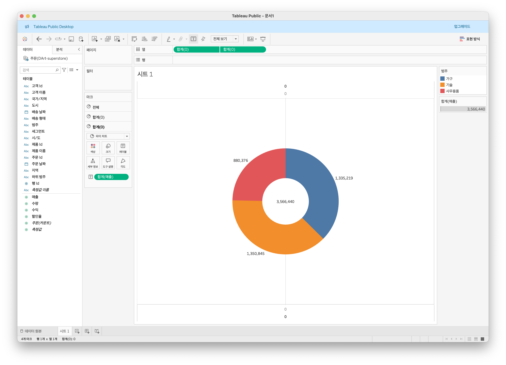

## 21강: 워드와 버블차트
<!-- 워드와 버블차트에 관해 배우게 된 점을 적어주세요 -->
### 버블차트
수치적 데이터를 원의 크기로 표현하는 차트이다   
(포현방식을 활용하면 쉽게 접근할 수 있다)

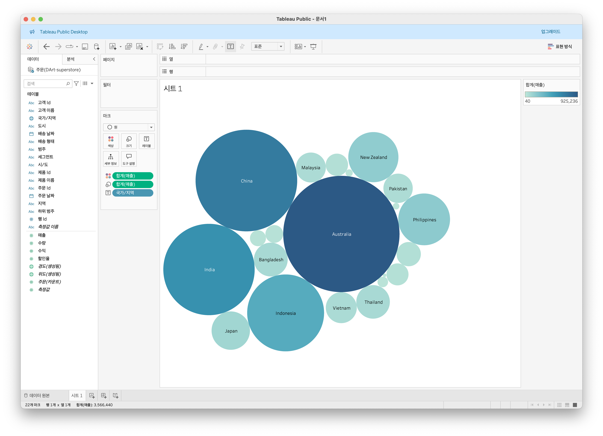
### 워드클라우드
얼마나 해당 텍스트가 많이 나오는지 시각화하는 차트이다.   
"측정값 -> 카운트"로 진행하여야 한다(바로 카운트가 뜨지 않음)   

1. 마크에 값올리고 (카운트)
2. 측정할 값을 텍스트로 마크에 가져다둠
3. 마크를 텍스트로 변경

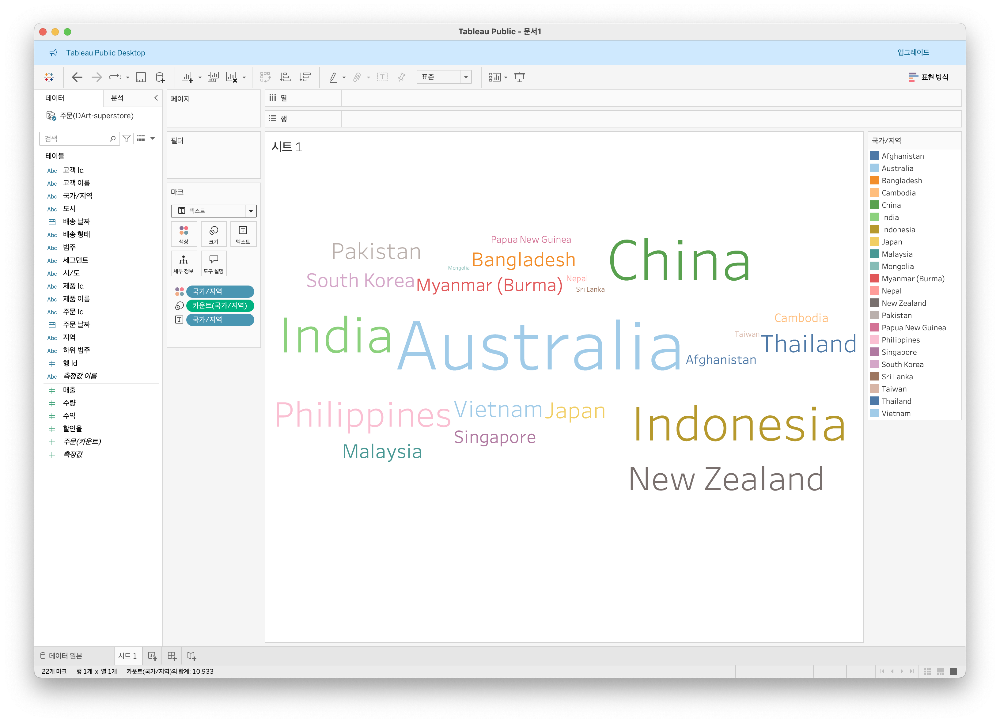


## 22강: 이중축과 결합축
<!-- 이중축과 결합축에 관해 배우게 된 점을 적어주세요 -->
### 이중축
하나의 뷰 안에서 축을 이중으로 사용한다   
개별 마크가 적용가능하다 + 동기화 후 축을 지우면 이쁘다


## 23강: 분산형 차트
<!-- 분산형 차트에 관해 배우게 된 점을 적어주세요 -->
파라미터간의 상관관계 비교에 좋은 차트

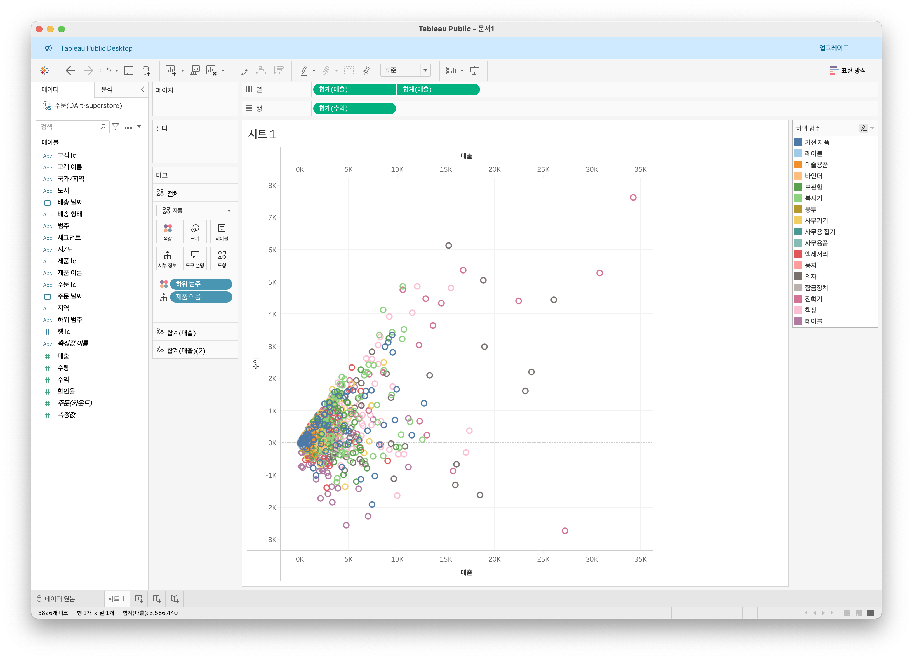


## 24강: 히스토그램
<!-- 히스토그램에 관해 배우게 된 점을 적어주세요 -->
분포형태 표시 - 연속형 측정값 범위혹은 구간으로 그룹화

측정값만으로 그릴때 주로 사용

구간차원 : 일정한 차원의 크기를 만듬

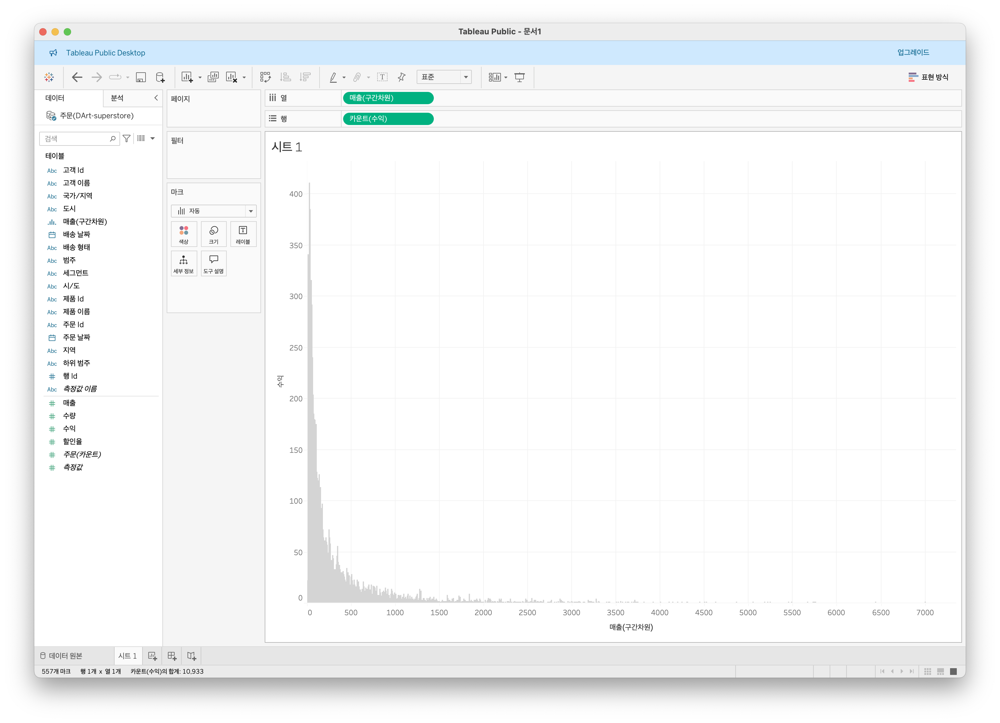

## 25강: 박스플롯
<!-- 박스플롯에 관해 배우게 된 점을 적어주세요 -->
이상치를 처리하는데 적합한 plot   
(표현방식 활용)
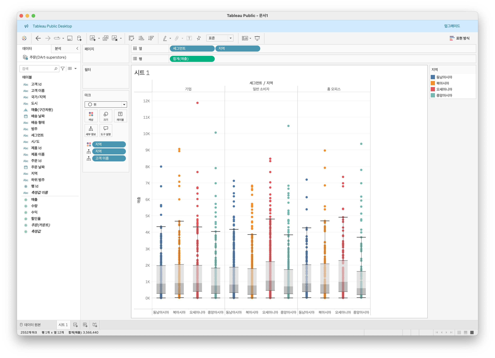

## 26강: 영역차트
<!-- 영역차트에 관해 배우게 된 점을 적어주세요 -->
라인과 축사이가 색으로 채워진 차트
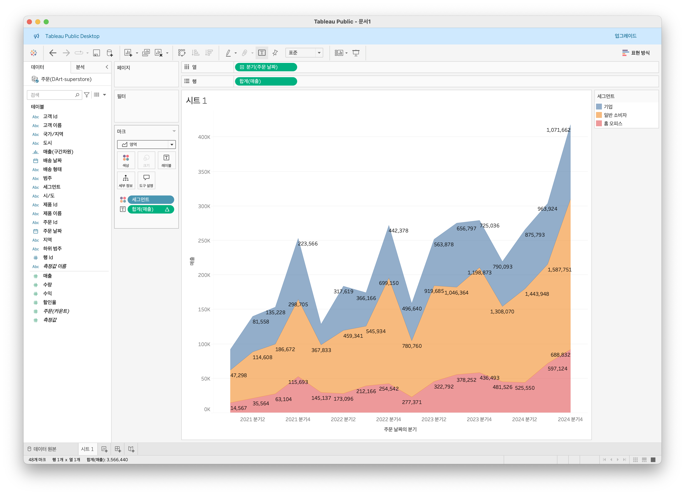


## 27강: 간트차트
<!-- 간트차트에 관해 배우게 된 점을 적어주세요 -->
시간경과에따른 기간을 시각화하는데 사용   
마크에 간트 활용   
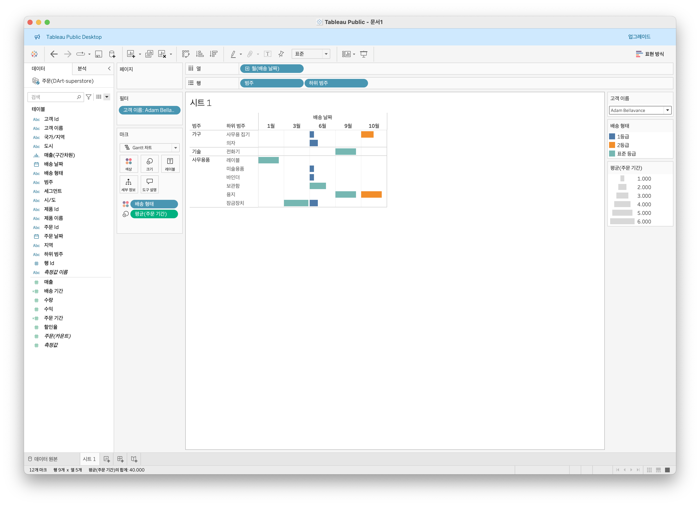


## 28강: 필터
<!-- 필터에 관해 배우게 된 점을 적어주세요 -->
### 컨텍스트 필터
최우선 필터링을 진행하여 나머지 필터를 종속적으로 운용할 수 있다.
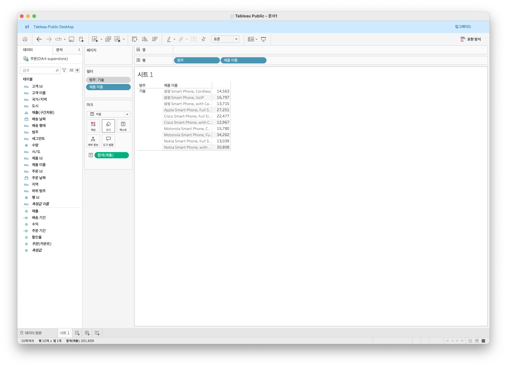
### 차원 필터

#### 일반

- 목록에서 선택 : 해당 목록내의 목록
    - → “제외”를 통해서 해당 반대로 적용도 가능
- 사용자 지정 값
- 모두

#### 와일드 카드

- “찾기”의 정규표현식 같은 느낌

#### 조건

- “조건문” 같은 느낌

#### 상위

- head(), tail()같은 느낌

## 29강: 그룹
<!-- 그룹에 관해 배우게 된 점을 적어주세요 -->
### 그룹

수동으로 필터링, 사용자 지정 그룹필드 만들 수 있음

#### 뷰 → 그룹

#### 테이블 → 그룹


## 문제 1.

```js
유정이는 superstore 데이터셋에서 '주문' 테이블을 보고 있습니다.
1) 국가/지역 - 시/도- 도시 의 계층을 생성했습니다. 계층 이름은 '위치'로 설정하겠습니다.
2) 날짜의 데이터 타입을 '날짜'로 바꾸었습니다.

코로나 시기의 도시별 매출 top10을 확인하고자
1) 배송 날짜가 코로나시기인 2021년, 2022년에 해당하는 데이터를 필터링했고
2) 위치 계층을 행으로 설정해 펼쳐두었습니다.
이때, 매출의 합계가 TOP 10인 도시들만을 보았습니다.
```


```
겉보기에는 전체 10개로, 잘 나온 결과처럼 보입니다. 그러나 유정이는 치명적인 실수를 저질렀습니다.
오늘 배운 '컨텍스트 필터'의 내용을 고려하여 올바른 풀이 및 결과를 구해주세요.
```
```
상위 10개순으로 되어있지 않았다
컨텍스트 필터를 활용하여 최우선으로 적용하여 진행하면 다음과 같은 결과가 나온다
```
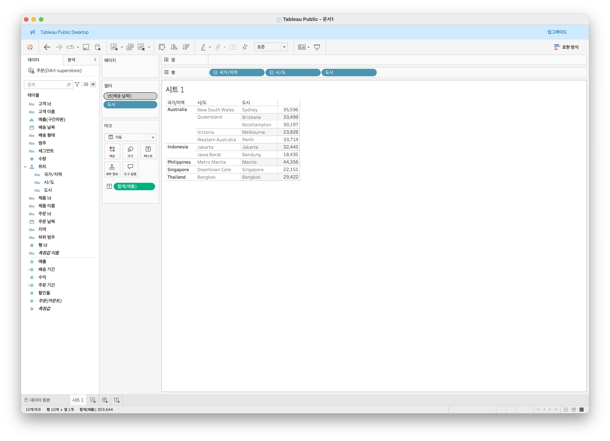

## 문제 2.

```js
태영이는 관심이 있는 제품사들이 있습니다. '제품 이름' 필드에서 '삼성'으로 시작하는 제품들을 'Samsung group'으로, 'Apple'으로 시작하는 제품들을 'Apple group'으로, 'Canon'으로 시작하는 제품들을 'Canon group'으로, 'HP'로 시작하는 제품들을 'HP group', 'Logitech'으로 시작하는 제품들을 'Logitech group'으로 그룹화해서 보려고 합니다. 나머지는 기타로 설정해주세요. 이 그룹화를 명명하는 필드는 'Product Name Group'으로 설정해주세요.

(이때, 드래그보다는 멤버 찾기 > 시작 문자 설정하여 모두 찾아 한번에 그룹화해 확인해보세요.)
```


```js
해당 그룹별로 어떤 국가/지역이 주문을 많이 차지하는지를 보고자 합니다. 매출액보다는 주문량을 보고 싶으므로, 주문Id의 카운트로 계산하겠습니다.

기타를 제외하고 지정한 5개의 그룹 하위 목들만을 이용해 아래와 같이 지역별 누적 막대그래프를 그려봐주세요.
```

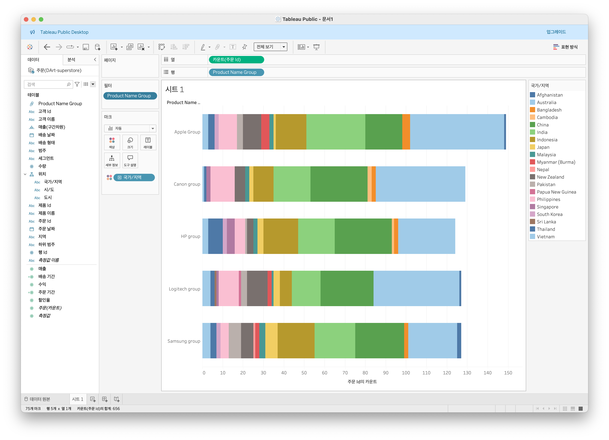


