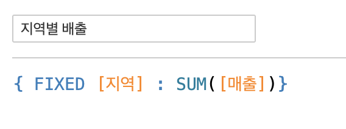
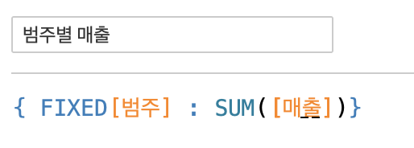
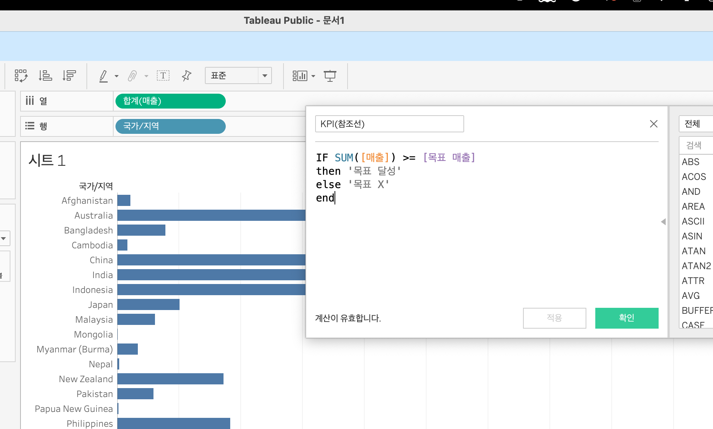
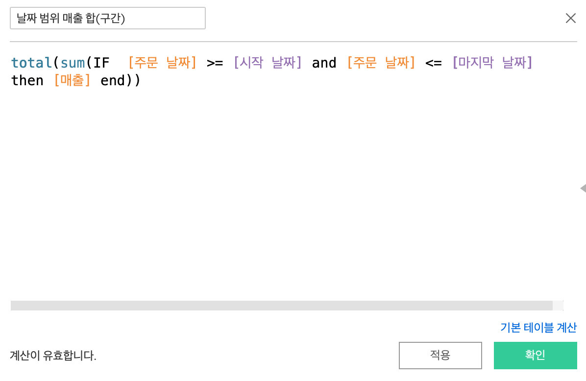
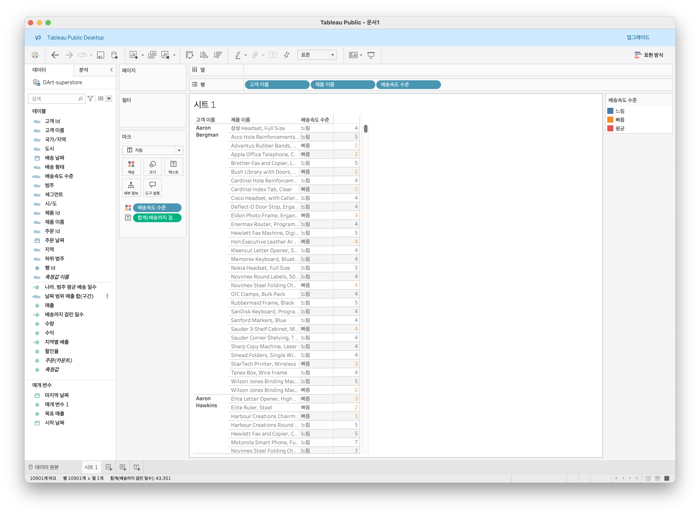
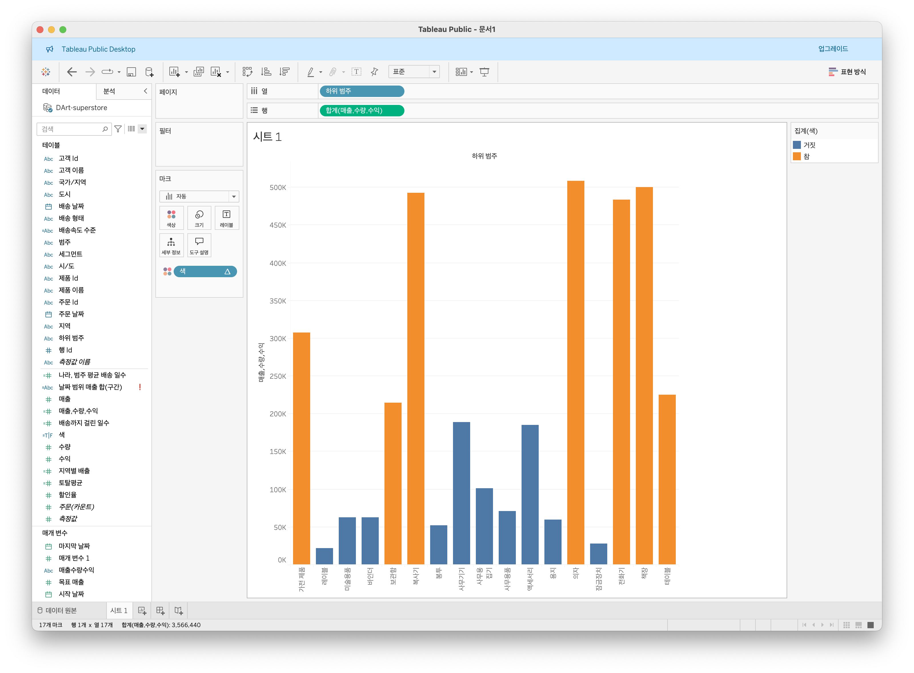

# Fifth Study Week

- 39강: [LOD](#39강-lod)

- 40강: [EXCLUDE](#40-lod-exclude)

- 41강: [INCLUDE](#41-lod-include)

- 42강 : [매개변수](#42-매개변수)

* (43강이 없어 패스합니다)
- 44강: [매개변수 실습](#44-매개변수-실습)

- 45강: [마크카드](#45-워크시트-마크카드)

- 46강: [서식계층](#46-서식-계층)

- 47강: [워크시트](#47-워크시트-서식)

- [문제1](#문제-1)

- [문제2](#문제-2)

- [문제3](#문제-3)

## Study Schedule

| 강의 범위     | 강의 이수 여부 | 링크                                                                                                        |
|--------------|---------|-----------------------------------------------------------------------------------------------------------|
| 1~9강        |  ✅      | [링크](https://www.youtube.com/watch?v=AXkaUrJs-Ko&list=PL87tgIIryGsa5vdz6MsaOEF8PK-YqK3fz&index=84)       |
| 10~19강      | ✅      | [링크](https://www.youtube.com/watch?v=AXkaUrJs-Ko&list=PL87tgIIryGsa5vdz6MsaOEF8PK-YqK3fz&index=75)       |
| 20~29강      | ✅      | [링크](https://www.youtube.com/watch?v=AXkaUrJs-Ko&list=PL87tgIIryGsa5vdz6MsaOEF8PK-YqK3fz&index=65)       |
| 30~39강      | ✅      | [링크](https://www.youtube.com/watch?v=e6J0Ljd6h44&list=PL87tgIIryGsa5vdz6MsaOEF8PK-YqK3fz&index=55)       |
| 40~49강      | 🍽️      | [링크](https://www.youtube.com/watch?v=AXkaUrJs-Ko&list=PL87tgIIryGsa5vdz6MsaOEF8PK-YqK3fz&index=45)       |
| 50~59강      | 🍽️      | [링크](https://www.youtube.com/watch?v=AXkaUrJs-Ko&list=PL87tgIIryGsa5vdz6MsaOEF8PK-YqK3fz&index=35)       |
| 60~69강      | 🍽️      | [링크](https://www.youtube.com/watch?v=AXkaUrJs-Ko&list=PL87tgIIryGsa5vdz6MsaOEF8PK-YqK3fz&index=25)       |
| 70~79강      | 🍽️      | [링크](https://www.youtube.com/watch?v=AXkaUrJs-Ko&list=PL87tgIIryGsa5vdz6MsaOEF8PK-YqK3fz&index=15)       |
| 80~89강      | 🍽️      | [링크](https://www.youtube.com/watch?v=AXkaUrJs-Ko&list=PL87tgIIryGsa5vdz6MsaOEF8PK-YqK3fz&index=5)        |


<!-- 여기까진 그대로 둬 주세요-->

> **🧞‍♀️ 오늘의 스터디는 지니와 함께합니다.**


## 39강. LOD : Level of Detail
* 현재 뷰 영향 X, 본인이 원하는 수준에서 계산 수행
* FIXED : 원하는 차원 계산
  * 설정한 차원 뷰 포함   



  * 설정한 차원 뷰 포함 X


<!-- INCLUDE, EXCLUDE, FIXED 등 본 강의에서 알게 된 LOD 표현식에 대해 알게 된 점을 적어주세요. -->


## 40. LOD EXCLUDE

<!-- INCLUDE, EXCLUDE, FIXED 등 본 강의에서 알게 된 LOD 표현식에 대해 알게 된 점을 적고, 아래 두 질문에 답해보세요 :) -->

> **🧞‍♀️ FIXED와 EXCLUDE을 사용하는 경우의 차이가 무엇인가요?**

```
EXCLUDE : 현재 뷰 특정차원 제거 후 계산
```

> **🧞‍♀️ 왜 ATTR 함수를 사용하나요?**

```
EXCLUDE를 통해 만든 하위 범주 수준에서 계산하기 위해 ATTR을 사용한다.
```


## 41. LOD INCLUDE

<!-- INCLUDE, EXCLUDE, FIXED 등 본 강의에서 알게 된 LOD 표현식에 대해 알게 된 점을 적고, 아래 두 질문에 답해보세요 :) -->

INCLUDE : 현재 뷰 특정차원 추가 후 계산

> **🧞‍♀️ 그렇다면 어떤 경우에 각 표현식을 사용하나요? 예시와 함께 적어보아요**


```
FIXED : 원하는 차원계산
INCLUDE, EXCLUDE : 원하는 차원 포함/제외 후 계산
```

## 42. 매개변수

* 매개변수 : 고정된 상수 아니고 동적인 값으로 변경 - 계산식, 필터, 참조선과 함께 사용
<!-- 매개변수에 대해 알게 된 점을 적어주세요 -->

> **🧞‍♀️ 집합에도 매개변수를 적용할 수 있나요? 시도해봅시다**

```
가능함
```
## 44. 매개변수 실습
(43번 강의가 없어 패스합니다)
* 참조선

* 참조구간

<!-- 매개변수에 대해 알게 된 점을 적어주세요 -->

## 45. 워크시트 마크카드
* 마크표현 방식
  * 색상, 크기, 레이블(폰트, 크기 등), 세부정보, 도구설명 
<!-- 마크카드에 대해 알게 된 점을 적어주세요 -->


## 46. 서식 계층
1. 워크 시트 서식
2. 행열 서식
3. 특정 필드
4. 필드 레이블
5. 도구 설명 / 제목 / 마크
* 아래로 갈수록 하위 및 구체적 위로갈수록 일반적
<!-- 서식계층에 대해 알게 된 점을 적어주세요 -->

> **🧞‍♀️ 서식계층을 일반적인 것에서 구체적인 것 순서로 기입해보세요**


```
1. 워크 시트 서식
2. 행열 서식
3. 특정 필드
4. 필드 레이블
5. 도구 설명 / 제목 / 마크
* 아래로 갈수록 하위 및 구체적 위로갈수록 일반적
```


## 47. 워크시트 서식
##### 워크시트 내
* 글꼴 : 텍스트 글꼴, 색상, 크기 설정
* 맞춤 : 정렬, 방향
* 음영 : 음영
<!-- 워크시트 서식에 대해 알게 된 점을 적어주세요!-->


## 문제 리스트


## 문제 1.

```
가장 많이 주문한 사람들은 물건 배송을 빨리 받았을까요?
조건을 준수하여 아래 이미지를 만들어봆시다.
1) 국가/지역별(이하 '나라'로 통칭), 범주별로 배송일자가 다를 수 있으니 먼저, 나라별/범주별로 평균 배송일자를 설정한 뒤,
2) 각 나라에서 가장 많이 주문한 사람의 이름을 첫 번째 열,
3) 그 사람이 주문한 제품 이름을 2번째 열,
4) 각 상품이 배송까지 걸린 날 수를 표현하고
5) 그리고 만약 배송이 각 나라/범주별 평균보다 빨랐다면 '빠름', 같다면 '평균', 느리다면 '느림' 으로 print 해주세요. 
```



<!-- 여기까지 오는 과정 중 알게 된 점을 기입하고, 결과는 시트 명을 본인 이름으로 바꾸어 표시해주세요.-->

## 문제 2.

```
채원이는 태블로를 쓰실 수 없는 상사분께 보고하기 위한 대시보드를 만들고 싶어요. 

제품 중분류별로 구분하되 매개변수로써 수익, 매출, 수량을 입력하면 저절로 각각 지표에 해당하는 그래프로 바뀌도록 설계하고자 해요.

 어떤 값이 각 지표의 평균보다 낮은 값을 갖고 있다면 색깔을 주황색으로, 그것보다 높다면 파란색으로 표시하고 싶어요. 그 평균값은 각 지표별로 달라야 해요.
```



<!-- 예시 사진은 지워주세요-->