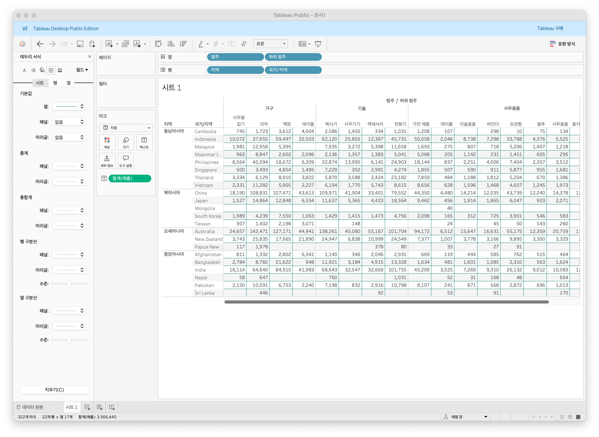
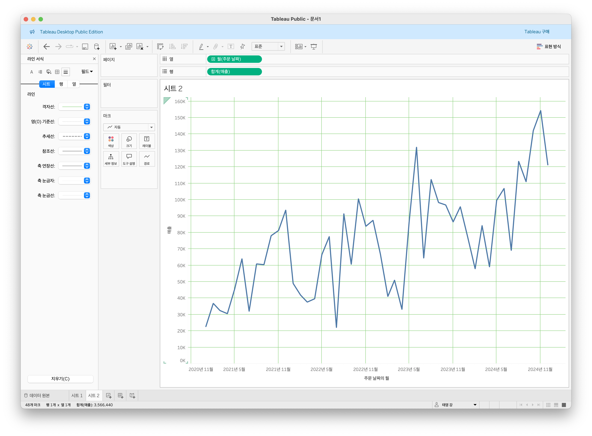
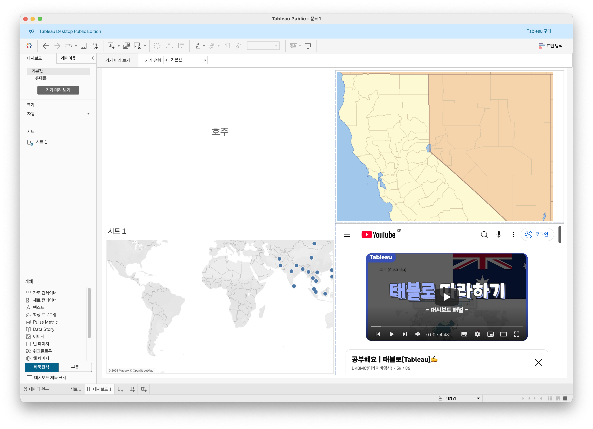
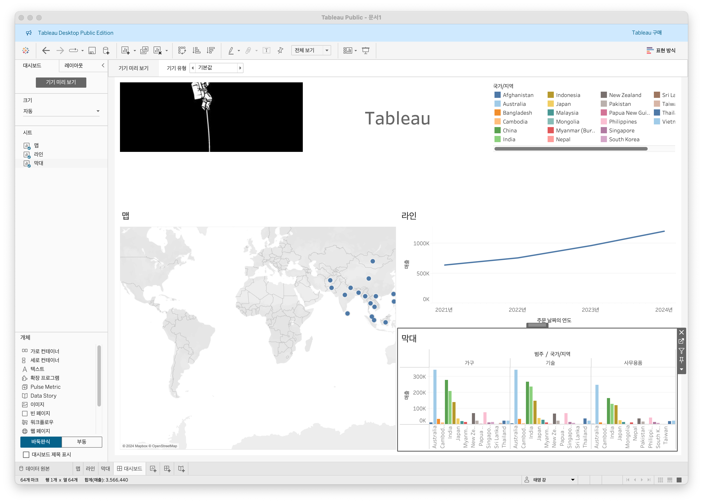
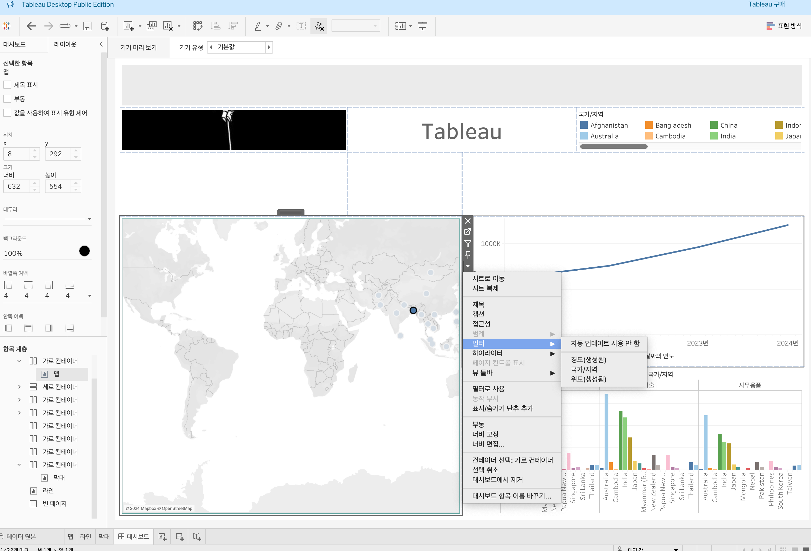
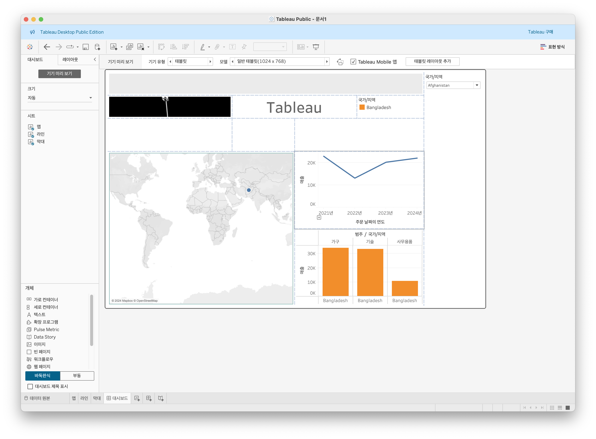
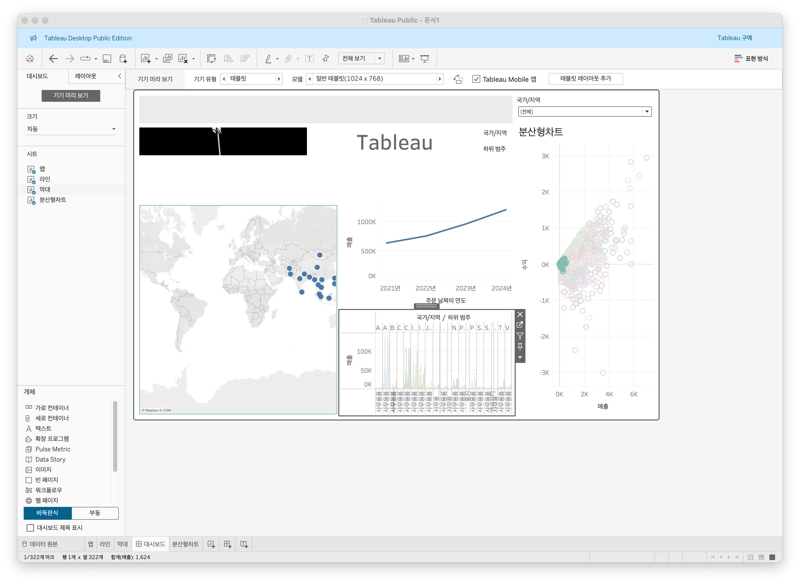
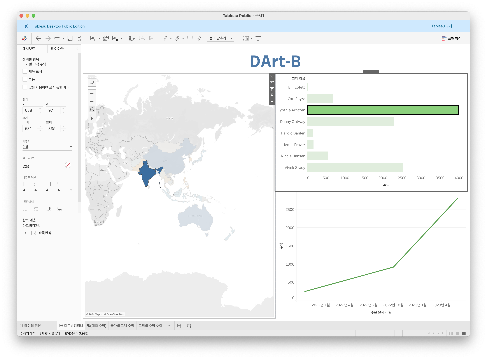
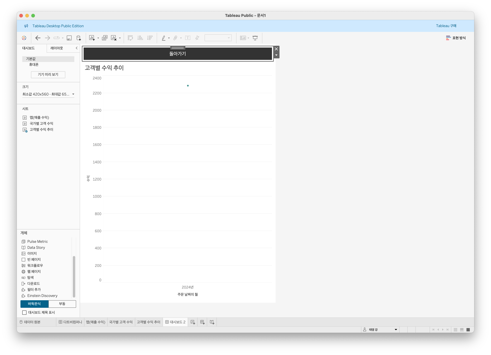

# Sixth Study Week

## Study Schedule
 

| 회차 | 강의 범위   | 강의 이수 여부 | 링크                                                                                                     |
|------|-------------|----------------|--------------------------------------------------------------------------------------------------------|
| 1    | 1~7강       | ✅              | [링크](https://www.youtube.com/watch?v=AXkaUrJs-Ko&list=PL87tgIIryGsa5vdz6MsaOEF8PK-YqK3fz&index=84)    |
| 2    | 8~17강      | ✅              | [링크](https://www.youtube.com/watch?v=AXkaUrJs-Ko&list=PL87tgIIryGsa5vdz6MsaOEF8PK-YqK3fz&index=75)    |
| 3    | 18~27강     | ✅              | [링크](https://www.youtube.com/watch?v=AXkaUrJs-Ko&list=PL87tgIIryGsa5vdz6MsaOEF8PK-YqK3fz&index=65)    |
| 4    | 28~37강     | ✅              | [링크](https://www.youtube.com/watch?v=e6J0Ljd6h44&list=PL87tgIIryGsa5vdz6MsaOEF8PK-YqK3fz&index=55)    |
| 5    | 38~47강     | ✅              | [링크](https://www.youtube.com/watch?v=AXkaUrJs-Ko&list=PL87tgIIryGsa5vdz6MsaOEF8PK-YqK3fz&index=45)    |
| 6    | 48~57강     | ✅              | [링크](https://www.youtube.com/watch?v=AXkaUrJs-Ko&list=PL87tgIIryGsa5vdz6MsaOEF8PK-YqK3fz&index=35)    |
| 7    | 58~67강     | 🍽️             | [링크](https://www.youtube.com/watch?v=AXkaUrJs-Ko&list=PL87tgIIryGsa5vdz6MsaOEF8PK-YqK3fz&index=25)    |
| 8    | 68~77강     | 🍽️             | [링크](https://www.youtube.com/watch?v=AXkaUrJs-Ko&list=PL87tgIIryGsa5vdz6MsaOEF8PK-YqK3fz&index=15)    |
| 9    | 78~85강     | 🍽️             | [링크](https://www.youtube.com/watch?v=AXkaUrJs-Ko&list=PL87tgIIryGsa5vdz6MsaOEF8PK-YqK3fz&index=5)     |
---

 
<!-- 여기까진 그대로 둬 주세요-->

> **🧞‍♀️ 오늘은 강의보다 실습과 대시보드 직접 만들기가 더 중요하니, 기록보다는 사고하며 강의를 들어주세요.**

## 48. 워크시트 서식(2)
테이터를 기준으로 구분
> **테두리** : 테이블, 페널, 셀 및 머리글을 둘러싸는 라인의 서식 설정   

> **라인** : 뷰에서 표시된 데이터의 축에 대한 라인의 모양을 설정

<!-- 워크시트에 관해 본 강의에서 알게 된 점을 적어주세요 -->

## 49강. 대시보드패널

> **대시보드** : 여러개의 차트 한번에 표시
* 생성방법 : 새 워크시트 옆에 -> 새 대시보드 클릭
* 크기 : 고정된 크기 - 자주 사용되는 크기들로 미리 설정되어 있음
* 시트 : 이미 생성된 시트들 - 생성시 대시보드의 시트에도 추가됨   
드래그 앤 드랍으로 시트를 대시보드에 가져옴
* 개체 : 유용한 개체들 있음

## 50. 대시보드 구성방식

<!-- 알게 된 점을 적고, 아래 질문에 답해보세요 :) -->

> **🧞‍♀️ 부동과 바둑판식 방식을 차이를 중점으로 기술해보세요**   

> **바둑판식** : 격자구조 - 다른 개체가 알아서 크기가 변경   
> **부동** : 사용자가 원하는 대로 - 다른 개체의 크기가 변경X   

바둑판식이 유용 - 대시보드 크기가 자주변경될때   
부동 - 자주 변경되지 않을때 + 빈공간이 많을때 유용

## 51. 대시보드 컨테이너
> **컨테이너** : 대시보드 개체들과 워크시트들을 그룹화하고 구성할 수 있는 공간
* 가로/세로 : 수평/수직

## 52. 레이아웃 패널
> **레이아웃 탭** : 대시보드 개체속성 변경

* 부동해제시 : 원위치로 돌아가지 않음
* 항목계층 활용하자

## 53. 필터 동작

<!-- 필터 동작에 대해 알게 된 점을 적어주세요 -->

* 마우스 오버 : 마크 위에 마우스를 놓으면 나머지 데이터가 해당 마크의 데이터로 변경
* 선택 : 마크 클릭하면 나머지 데이터가 선택한 마크의 데이터로 변경
* 메뉴 : 마크를 클릭할 때 마크의 도구 설명에 텍스트가 나타남
* 필터 누르면 바로 필터 동작 생성가능

## 54. 대시보드 하이라이터 동작
> 표시되는 데이터의 양이 많을때, 나머지 데이터와 구분하기 위해 사용
<!-- 하이라이터에 대해 알게 된 점을 적어주세요 -->

## 55. 대시보드 URL
> 대시보드 동작 url로 설정
* 주의점 : 필드로 마지막을 바꿔야 모든 차트를 따로따로 관리할 수 있음
<!-- URL에 대해 알게 된 점을 적어주세요 -->
* URL 보여주기 : 웹페이지 대시보드로 옮기고 주소 작성하지 말기 -> 이후 동작의 경우에 웹 페이지 개체가 없는 경우로 선택

## 56. 대시보드 시트에 이동 동작
> 대시보드 시트로 이동하여 -> 보기 편하게(넓게) 볼 수 있도록 해줌
<!-- 대시보드 시트에 이동에 대해 알게 된 점을 적어주세요!-->

## 57. 매개변수 변경 동작
> 대시보드에 적용시키기 위해서 매개변수를 시트에서 필터를 적용시킨다. 이는 대시보드 탭의 동작에서 매개변수 변경 동작을 추가한다. 이때 메뉴를 선택하고 대상 매개변수를 조정해주면 된다.

<!-- 매개변수 변경 동작에 대해 알게 된 점을 적어주세요!-->

## 문제

오늘은 별도의 문제가 없습니다. 

여러 대시보드를 참고하시어, superstore 데이터를 사용해 나만의 대시보드를 제작해주세요.

**단, 워크시트 3개 이상의 그래프를 표시해야 하며 각 시트 간 상호작용성 필터 or 하이라이트 동작은 꼭 추가되어야 합니다**

어떤 부분에 가중을 두었는지, 어떤 사용자 편의성을 고려하였는지에 대한 설명이 필요합니다.

* 맵(수익), 국가별 고객 수익, 고객별 수익 추이 시트 사용
* 맵에서 특정 나라를 고르면 옆의 막대차트에 해당지역 필터링(상위 10)이 진행됨,
* 아래의 라인차트는 막대차트의 막대를 클릭하지 않으면 꺼져있는 상태
* 라인차트가 활성화되면 점혹은 라인으로 나타나는데 이 경우 해당 라인이나 점을 누르면 시트로 이동
* 시트위의 돌아가기 버튼 지원