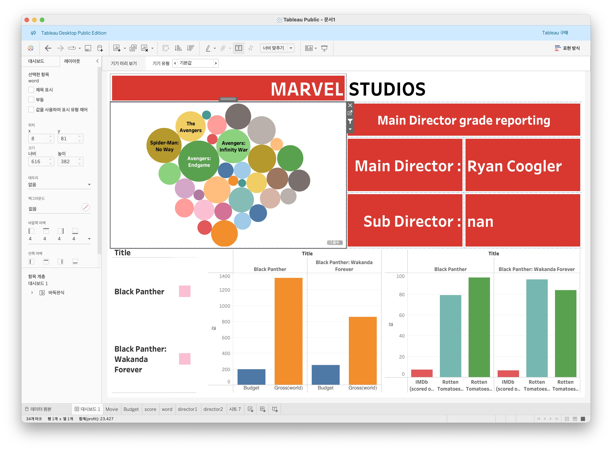
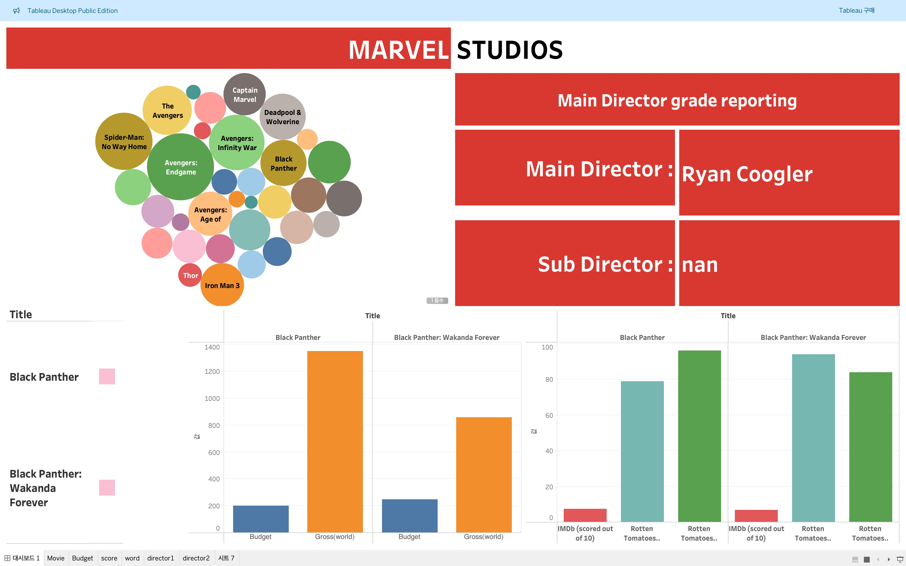
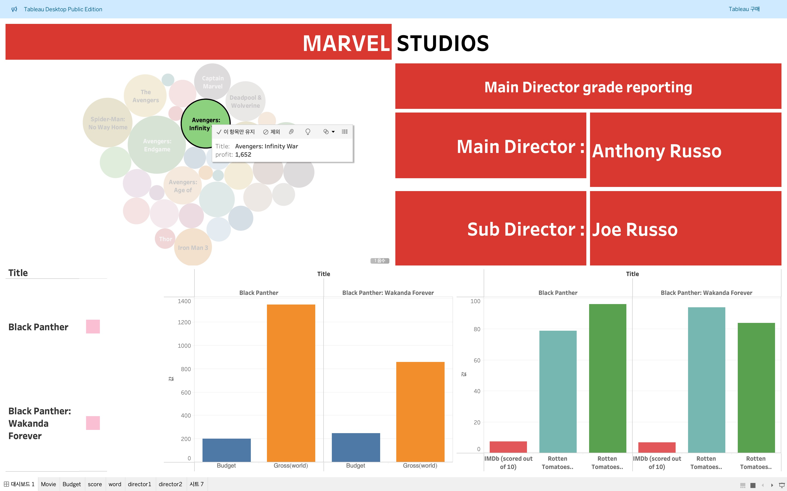
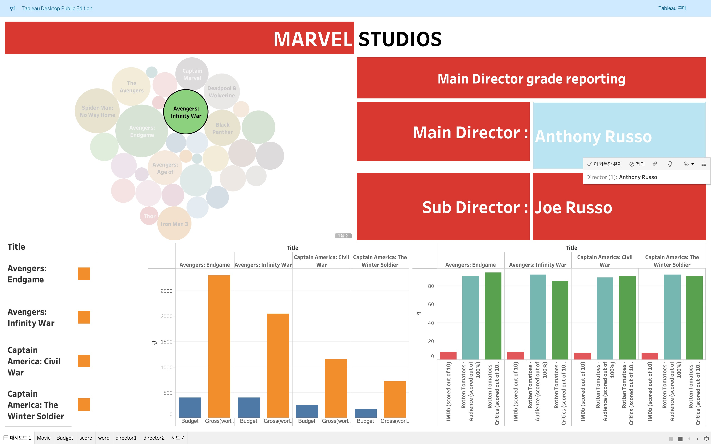

# 대시보드
## 사용 데이터셋
---
| Marvel Movies Dataset   
 
https://www.kaggle.com/datasets/sarthakbharad/marvel-movies-dataset

## 대시보드 링크
 
https://public.tableau.com/app/profile/.71053853/viz/1_17308050672150/1

## 대시보드

마블 스튜디오의 수익별 감독을 확인하고, 그 감독의 작품에 대한 수익과 스코어를 표시하는 대시보드

   

(스튜디오 오류로 인해서 조금 깨짐)   
1. 영화를 선택

  
2. 감독을 선택

그리고 추가적으로 제목을 누를경우 하이라이트 기능이 있어서 가시적으로 확인할 수 있음